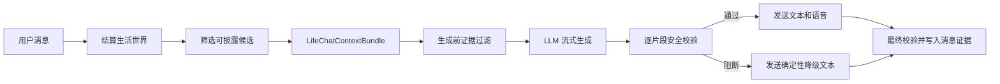

# 聊天事件溯源 v1

## 目标

当 UNA 在聊天中提到自己、NPC、共同事件、意向或建议时，最终消息必须能回答三个问题：引用了哪条世界事实、事实属于谁、生成后是否通过校验。

聊天溯源不从最终文字反向猜来源。`LifeChatContextService.build_context_bundle()` 在挑选上下文时，同时返回给模型看的安全文本和机器可读的 `ContentEvidence`；消息落库时把证据写入 `chat_history.content_evidence_json`。

## 处理流程

## 可引用来源

- `una_life_event`：UNA 自己已发生的事件，可以第一人称叙述。
- `npc_life_event`：NPC 自己的事件，只能明确转述为对方经历。
- `npc_interaction`：多方共同事件，必须保留参与者归属。
- `story_arc`：持续中的故事线，不得提前宣告完成。
- `una_intention`、`npc_intention`：打算，不是既成事实。
- `npc_suggestion`：NPC 对用户建议的自主回应，不是用户命令。

上下文构建会排除 `private` 来源以及提及度、公开度不足的事件。相同来源按 `source_type + source_id` 去重。

## 消息落库规则

用户消息仍可使用空证据包。AI 消息若本轮取得生活上下文，则必须保存：

- 所有允许进入生成上下文的来源；
- 最终文本实际命中的 `used_source_ids`；
- `validation_status` 和 `validation_codes`；
- 生成原因和生成器版本。

旧消息没有证据时保持可读。内容审计会把旧的 NPC 生活叙述标记为 `chat_source_untraceable`，新消息有可验证来源时计入 `traceable_life_chat_count`。

## 流式边界

只要本轮包含生活证据，模型片段会先在服务端缓冲，整条回复组合完成并通过回复级校验后，才按原片段边界进入 WebSocket 和语音队列。命中高风险规则后：

1. 当前错误片段不发送；
2. 后续模型片段不再发送；
3. 发送一条固定、安全、不声称新事实的聊天降级文本；
4. 消息证据以 `blocked` 和具体代码落库。

因此跨片段才能形成的错误声明也会被识别，用户不会先看到部分错误内容，再看到系统撤回。没有生活证据的普通聊天仍保留原来的低延迟流式发送路径。

## 验收基准

- UNA 正确叙述自己的事件：通过并保存使用来源。
- UNA 明确说“小满最近……”：允许转述小满事件。
- UNA 把小满事件说成“我今天去了……”：阻断，代码为 `npc_experience_claimed_by_una`。
- 把 active/deferred 意向描述成已经完成：阻断，代码为 `unfinished_source_as_completed`。
- 旧聊天无证据：仍可读取，审计给出兼容提示。
