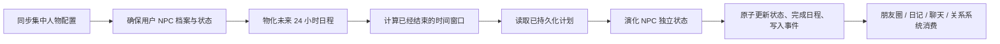

# NPC 自主生活 v1 开发基准

## 目标

小满、知夏和阿岚只是当前展示名称。运行时始终使用 `npc_preset_1`、`npc_preset_2`、`npc_preset_3` 三个稳定 ID，让预设人物可以在最终提交前替换，而数据库关系不失效。

NPC 自主生活 v1 负责四件事：

1. 每个用户世界都有独立的 NPC 角色档案。
2. 每个 NPC 都有独立、持久、可连续演化的状态。
3. 日程先计划并写入数据库，到时间后再执行。
4. 执行结果形成 NPC 自己的事件，供后续朋友圈、日记、聊天和关系系统消费。

## 权威数据

人物定义和生活素材集中在 `backend/life_simulation/characters/presets.yaml`：

- `characters`：姓名、人格、兴趣、说话方式和日程模板键。
- `routine_templates`：按生活窗口组织的活动、地点、客观摘要、主观解释、私密想法、公开程度和状态变化。

业务代码不得根据“小满”“知夏”“阿岚”等显示名称分支。新增或替换人物时，只调整配置，稳定 `actor_id` 不变。

## 数据模型

### `ai_actor_profiles`

用户世界中的持久人物档案。配置更新会同步默认名称和版本，未来的用户覆盖字段不会被全局配置覆盖。

### `ai_actor_states`

每个 NPC 一行独立状态：

- 当前地点和活动
- 精力、饥饿、压力、社交需求、独处需求
- 当前情绪和活跃目标
- `last_settled_at` 状态游标
- `state_version` 乐观锁版本
- 模拟器版本

### `ai_actor_schedules`

持久日程。唯一键为用户、NPC、标准时间窗口开始时间和窗口类型。日程创建后保存完整 `plan_json`，即使服务重启或配置更新，已经计划的活动仍能按原计划执行。

日程状态目前为：

- `planned`：已经计划，尚未到结算时间。
- `completed`：窗口已执行并写入事件。

### `ai_actor_events`

NPC 独立事件账本，记录客观事实、可提及程度、可公开程度、主观解释和私密想法。对客户端 API 只返回安全字段，不返回 `private_thought` 和内部 `facts`。

## 结算流程

结算是惰性离线补算：用户离线期间不要求进程持续运行；用户再次访问、定时任务触发或服务主动结算时，根据状态游标补齐已结束窗口。相同窗口重复结算不会产生重复事件。

离线超过七天时，先为每个 NPC 写入长期摘要，再详细结算最近七天，避免一次请求无限回放历史。

## API

- `GET /api/life/actors`：活跃角色列表。
- `GET /api/life/actors/{actor_id}/life`：NPC 当前安全状态和未来 24 小时日程。
- `GET /api/life/actors/{actor_id}/events`：NPC 独立事件，可按时间、重要程度和数量过滤。

旧 ID `ai_xiaoman`、`ai_zhixia`、`ai_alan` 仍可用于请求，服务会解析为稳定 ID。

## 安全与一致性约束

- 所有表以 `owner_user_id` 隔离，不允许跨用户读取。
- NPC 状态更新、日程完成和事件创建在同一个 SQLite 事务中完成。
- `state_version` 防止并发补算覆盖状态。
- 日程 ID 和事件幂等键由用户、NPC、时间窗口和模拟器版本稳定生成。
- 停用人物保留历史档案和事件，但不再创建新状态、日程或事件，也不会出现在活跃角色 API 中。

## 后续开发顺序

1. **NPC 表达层 v1（已完成）**：从高 `publicability` 的 NPC 事件生成朋友圈；记录源事件 ID，避免重复。
2. **NPC 聊天上下文 v1（已完成）**：从高 `mentionability` 事件生成可披露近况，让 UNA 在合适语境中自然提起。
3. **NPC 关系与互动 v1**：NPC 之间、NPC 与 UNA 的互动必须同时写入参与者视角和关系变化。
4. **日程影响与用户选择**：用户建议可以形成意向，但 NPC 保留接受、延后或拒绝的自主判断。
5. **管理与调试界面**：显示人物状态、未来日程、事件来源和结算诊断，不暴露私密想法给普通用户。

后续阶段必须消费 `ai_actor_events`，不能绕过事件层直接生成互相矛盾的朋友圈、日记或聊天故事。
