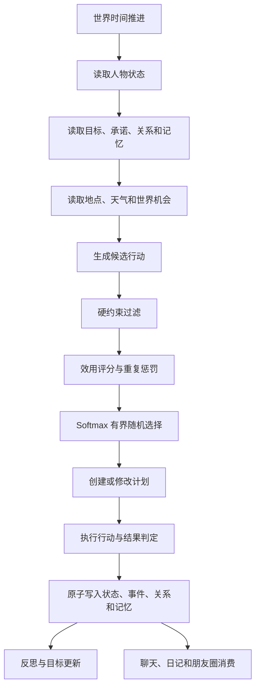

# NPC 更自由、更像人的生活模拟 v2 设计

> 文档状态：v2 主体与七项长期增量已实现，等待人工验收
> 创建日期：2026-08-13
> 最近更新：2026-08-14
> 适用项目：UNA / AI 生活模拟
> 前置版本：`NPC 自主生活 v1`
> 实现基线：`docs/npc-agency-v2-delivery-baseline.md`
> 后续开发要求：开始相关开发前，先阅读本文和 `docs/npc-autonomous-life-v1.md`。

## 1. 文档目的

本文用于指导 NPC 生活模拟从“预设时间窗口中选择完整活动模板”升级为“由人物状态、性格、目标、关系、记忆和环境共同驱动的自由决策系统”。

目标不是让大模型随时自由编故事，而是在保证世界事实一致、成本可控、结果可复现的前提下，让 NPC 表现出以下特征：

- 有相对稳定的生活习惯，但不会每天完全重复。
- 有即时需求，也有可以持续多天或更久的个人目标。
- 会做计划，也会因为情绪、精力、天气、邀请或意外改变计划。
- 会主动联系别人，也会拒绝、推迟或忽略邀请。
- 同一情境下可能做出不同但仍符合人设的选择。
- 过去发生的事情会影响后续行为、关系和表达。
- 行为先形成客观事实，聊天、日记和朋友圈再基于事实表达。
- 用户离线或后端停止运行后，世界仍可通过幂等补算连续推进。

本文是后续开发的长期基准。若实现与本文发生冲突，应先更新本文并说明原因，再修改代码。

### 1.1 当前实现状态

截至 2026-08-13：

- 阶段一至阶段五的主体任务已经完成，继续保留 v1 已物化日程的兼容结算路径。
- 日/周反思、记忆巩固与衰减、目标生命周期、完整硬约束、显式重要决策触发、原子预算、90 天稳定性、14 天停机补算和后台质量任务等七项长期增量已经完成。
- 数据库迁移已推进至版本 17；迁移 11 的真实数据库副本升级至 17 后，完整性检查结果为 `ok`。
- 自动化收口基线为后端 395 项通过、前端 332 项通过、生产构建通过、Python 编译和 `git diff --check` 通过。
- 重要决策 LLM 默认关闭；普通行为和离线补算不依赖 LLM，关闭模型后系统仍可完整运行。
- 自动化通过不等于人工体验已经通过；发布前仍须按 23.5 节完成人工验收并留存证据。

当前不阻断 v2 主体验收、但可在后续版本继续增强的项目：

- 将基础情绪状态扩展为完整的 `valence`、`arousal`、`loneliness`、`irritation` 等情绪向量。
- 增强新事实与旧判断冲突时的显式记忆纠错，以及用户偏好、约定的长期记忆语义。
- 扩充质量指标，使新地点比例、连续三次重复、计划变更原因和人物差异等指标全部自动展示。
- 增加后台质量任务在进程重启后的自动恢复和并发队列上限。
- 在配置真实模型凭据的隔离环境中补充重要决策 LLM 的人工端到端验收。

---

## 2. 历史 v1 基线

### 2.1 已有能力

当前系统已经具备：

- 小满、知夏、阿岚的集中角色配置。
- 每个用户独立的 NPC 档案、状态、日程和事件。
- 未来 24 小时日程物化。
- 用户离线后的惰性补算和定时增量结算。
- NPC 之间的互动、关系、意图和用户建议处理。
- 事件驱动的朋友圈、日记和聊天上下文。
- 内容证据、安全门禁、幂等键和世界检查页面。

主要代码位置：

- 角色与活动配置：`backend/life_simulation/characters/presets.yaml`
- NPC 日程与结算：`backend/life_simulation/npc_life.py`
- 总体结算编排：`backend/life_simulation/service.py`
- SQLite 存储：`backend/life_simulation/store.py`
- NPC 互动：`backend/life_simulation/npc_interactions.py`
- NPC 意图：`backend/life_simulation/npc_intentions.py`
- 用户建议：`backend/life_simulation/npc_suggestions.py`
- 聊天上下文：`backend/life_simulation/chat_context.py`
- 社交世界：`backend/life_simulation/social_world.py`
- 内容安全：`backend/life_simulation/content_safety.py`
- 调试 API：`backend/life_simulation/api.py`
- 检查页面：`frontend_react/src/components/life/NpcWorldInspector.jsx`

### 2.2 v1 核心限制（已由 v2 主体解决）

v1 的活动选择流程基本为：

```text
到达标准时间窗口
→ 从角色绑定的 routine_template 中读取候选完整活动
→ 使用稳定随机种子选择一个活动
→ 按模板更新状态
→ 生成一条生活事件
```

这个方案稳定、便宜、可测试，但存在以下问题：

- 活动仍是完整预设句子，长期运行容易重复。
- NPC 当前需求对活动选择的影响有限。
- 长期目标没有成为普通生活的核心驱动力。
- 计划和实际行为之间缺少明确差异。
- 临时改变计划的原因不够丰富。
- 环境机会、地点约束和时间成本较弱。
- NPC 很难形成“最近正在忙一件事”的连续生活感。

---

## 3. v2 总体原则

### 3.1 规则维护事实，模型负责有限决策和表达

系统职责划分：

| 层级 | 主要职责 | 是否允许 LLM 决定 |
|---|---|---|
| 世界事实层 | 时间、地点、通勤、开放时间、人物位置、资源和约定 | 否 |
| 状态演化层 | 精力、饥饿、压力、无聊、社交需求等数值变化 | 否 |
| 候选行动层 | 根据需求、目标、关系和环境生成可执行选项 | 默认否 |
| 行动选择层 | 评分、约束校验、带温度抽样 | 普通行为否，重要分歧点可选 |
| 结果层 | 产生客观事实、状态变化、关系变化和记忆 | 否 |
| 表达层 | 聊天、日记、朋友圈和主观叙述 | 是，但必须基于证据 |

### 3.2 自由不等于无约束随机

随机性必须满足：

- 选择必须在人设允许的候选范围内。
- 选择必须满足时间、地点、资源和承诺约束。
- 随机只影响多个合理选项之间的选择。
- 重大事件的概率必须低于普通生活事件。
- 随机结果必须记录种子、候选项和得分，便于复盘。

### 3.3 事实先于表达

所有朋友圈、日记和聊天生活内容必须引用已经写入事件账本的事实。LLM 不得直接创造未结算的地点、参与者、关系变化或经历。

### 3.4 计划允许失败

“像人”不仅是能做更多事，也包括：

- 拖延。
- 做到一半停下。
- 因疲惫取消计划。
- 因为临时邀请改变安排。
- 对用户建议选择接受、推迟或拒绝。
- 对失败进行反思，之后重试或放弃。

---

## 4. 目标架构



建议将模拟逻辑拆成以下服务：

```text
WorldContextService
ActionCatalog
CandidateGenerator
ConstraintEvaluator
UtilityScorer
DecisionSampler
PlanManager
ActionExecutor
OutcomeResolver
MemoryConsolidator
ReflectionService
ImportantDecisionLLMAdapter
```

---

## 5. 人物心理模型

### 5.1 即时状态

保留已有字段，并建议增加：

| 字段 | 范围 | 说明 |
|---|---:|---|
| energy | 0～100 | 精力，低值限制高消耗行动 |
| hunger | 0～100 | 饥饿，高值提升进食优先级 |
| stress | 0～100 | 压力，高值提升恢复和逃避行为 |
| social_need | 0～100 | 社交需求 |
| solitude_need | 0～100 | 独处需求 |
| boredom | 0～100 | 无聊程度，推动新鲜行为 |
| focus | 0～100 | 专注度，影响目标行动持续时间 |
| confidence | 0～100 | 自信度，影响主动性和冒险行为 |
| comfort | 0～100 | 当前环境舒适度 |

### 5.2 稳定性格参数

建议在角色档案中增加：

```yaml
decision_style:
  spontaneity: 0.45
  routine_preference: 0.65
  novelty_seeking: 0.38
  plan_commitment: 0.72
  social_initiative: 0.55
  risk_tolerance: 0.30
  persistence: 0.68
  emotional_sensitivity: 0.57
```

字段含义：

- `spontaneity`：提高选择分布温度和临时变更概率。
- `routine_preference`：提高习惯活动权重。
- `novelty_seeking`：提高新地点、新活动和低频行为权重。
- `plan_commitment`：降低无充分原因的计划取消概率。
- `social_initiative`：提高主动邀请、发消息和参与活动的概率。
- `risk_tolerance`：提高不确定行动权重。
- `persistence`：影响失败后重试和长期目标持续性。
- `emotional_sensitivity`：放大事件对情绪和关系的影响。

### 5.3 情绪向量

不再只依赖一个情绪标签。建议保存：

```json
{
  "valence": 0.25,
  "arousal": 0.55,
  "confidence": 0.42,
  "loneliness": 0.18,
  "irritation": 0.08
}
```

情绪不直接指定行动，而是修正候选行动得分。例如孤独提高社交候选得分，烦躁降低高社交密度场景的得分。

当前实现已经使用基础情绪标签、信心及多项状态数值参与决策；上面的完整情绪向量仍属于后续增强项，不作为本轮 v2 主体完成与否的阻断条件。

---

## 6. 从完整模板升级为行动原子

### 6.1 行动原子定义

模板不再直接表示一条完整生活故事，而是定义可组合的行为能力。

```yaml
action_atoms:
  read:
    categories: [quiet, learning]
    allowed_locations: [home, library, cafe]
    duration_minutes: [20, 120]
    base_cost:
      energy: 4
    base_effect:
      boredom: -12
      stress: -5
    requirements:
      min_focus: 20

  work_on_goal:
    categories: [productive, goal]
    goal_required: true
    duration_minutes: [30, 180]
    base_cost:
      energy: 12
      stress: 5

  invite_friend:
    categories: [social]
    target_required: true
    duration_minutes: [2, 10]
    requirements:
      min_social_need: 25
```

### 6.2 组合后的具体行动

行动由若干参数共同组成：

```json
{
  "action_type": "read",
  "location_id": "old_bookstore",
  "subject": "新到的画册",
  "duration_minutes": 70,
  "goal_id": "prepare_visual_notes",
  "participants": [],
  "motivation": "curiosity"
}
```

最终事件可以表达为：

> 知夏下午去了旧书店，在角落翻看新到的画册，并记下了几页配色想法。

其中“去旧书店”“阅读”“推进配色笔记目标”来自组合，而不是一条完整固定模板。

### 6.3 保留模板的用途

现有 `routine_templates` 不立即删除，而是逐步降级为：

- 行为先验权重。
- 常见地点和活动组合。
- 人设边界。
- 特殊事件素材。
- v1 兼容回退方案。

---

## 7. 候选行动生成

每次决策从多个来源生成候选项，最后去重并合并相同意图。

### 7.1 日常惯性候选

来自角色习惯、星期和时间段。例如工作日上午吃早餐、通勤、工作，晚上洗澡和休息。

惯性活动具有较高基础分，但不是强制行为。

### 7.2 需求候选

需求超过阈值时产生：

- 饥饿高：吃饭、做饭、买食物。
- 精力低：休息、提前回家、降低活动强度。
- 压力高：散步、听音乐、独处、找信任的人聊天。
- 社交需求高：发消息、邀请朋友、去社交地点。
- 无聊高：探索新地点、尝试新行为、联系不常联系的人。

### 7.3 目标候选

中长期目标产生推进动作、准备动作、回顾动作和放弃动作。

例如“完成摄影集”可以产生：

- 出门拍摄。
- 整理照片。
- 查找拍摄地点。
- 和朋友讨论作品。
- 因压力拖延。
- 失败后重新安排。

### 7.4 关系候选

根据关系和记忆产生：

- 主动联系。
- 接受、拒绝或推迟邀请。
- 道歉或修复关系。
- 分享事件。
- 因紧张而回避。
- 对长期没有互动的人重新建立联系。

### 7.5 承诺候选

硬性或半硬性承诺包括：

- 工作和课程。
- 已接受的约会。
- 用户与 NPC 达成的约定。
- 截止日期临近的目标任务。

承诺通常具有高分，并在取消时要求产生明确原因和后果。

### 7.6 环境机会候选

来自世界状态：

- 天气变化。
- 地点营业状态。
- 公共活动。
- 附近人物。
- 临时邀请。
- 路过新地点。
- 交通延迟。

### 7.7 记忆触发候选

地点、人物、日期和相似情境可以触发记忆，再产生行动：

- 经过旧地点想起以前的约定。
- 用户曾推荐一本书，于是决定寻找或阅读。
- 上次做菜失败，决定重试或回避。
- 想起与朋友的冲突，决定道歉或继续冷静。

### 7.8 低概率意外候选

意外只能来自经过批准的意外目录，并具有冷却期：

- 丢失普通小物品。
- 偶遇朋友。
- 临时收到邀请。
- 原计划因外部原因失败。
- 买到意外喜欢的东西。

禁止默认生成严重疾病、事故、失业、死亡、重大财务损失等高风险剧情。此类剧情必须经过用户设置和更严格的审批策略。

---

## 8. 硬约束过滤

候选行动评分前必须检查：

- 地点是否开放。
- 是否有足够通勤时间。
- NPC 是否已在其他地点或正在执行不可中断行动。
- 是否与已接受承诺冲突。
- 当前精力是否满足最低要求。
- 是否需要但缺少参与者、资源或目标。
- 目标人物是否有时间、是否愿意参与。
- 人设是否禁止该行为。
- 事件是否违反安全策略或用户设置。

硬约束不满足时，候选项直接淘汰，不交给 LLM 修正。

---

## 9. 效用评分与随机选择

### 9.1 评分公式

建议所有分项标准化到约 `-100～100`：

```text
utility =
    personality_fit
  + need_satisfaction
  + goal_progress
  + relationship_motivation
  + commitment_value
  + environment_fit
  + memory_relevance
  + habit_strength
  + mood_bias
  - energy_cost
  - time_cost
  - travel_cost
  - risk_cost
  - repetition_penalty
  - plan_conflict_penalty
  + bounded_noise
```

### 9.2 默认权重建议

| 分项 | 默认最大影响 |
|---|---:|
| 承诺价值 | +70 |
| 紧急需求满足 | +60 |
| 目标推进 | +45 |
| 关系动机 | ±40 |
| 性格适配 | ±30 |
| 习惯强度 | +30 |
| 环境机会 | +25 |
| 记忆相关 | ±25 |
| 重复惩罚 | -45 |
| 计划冲突 | -80 |
| 风险和成本 | -60 |
| 有界随机 | ±12 |

具体权重后续必须通过检查页面和批量模拟校准，不应仅凭直觉固定。

### 9.3 Softmax 抽样

不能始终选择最高分，否则人物会表现得像优化器。应对通过约束的候选使用 Softmax 抽样：

```text
P(action_i) = exp(score_i / temperature) / Σ exp(score_j / temperature)
```

`temperature` 由以下因素共同决定：

- 人物 `spontaneity`。
- 当前无聊程度。
- 当前压力。
- 是否存在硬性计划。
- 最近计划变更次数。

硬性承诺场景温度应低，自由时间温度可以高。

### 9.4 可复现随机

随机种子至少包含：

```text
owner_user_id
actor_id
decision_time_bucket
state_version
decision_engine_version
```

同一状态重复结算应得到同一选择，状态或版本变化后才允许变化。

---

## 10. 日程模型：锚点计划与弹性时间

### 10.1 锚点计划

必须或很可能执行：

- 工作、课程和预约。
- 已接受的邀请。
- 用户和 NPC 明确约好的事项。
- 截止日期临近的任务。
- 基础睡眠窗口。

### 10.2 弹性时间

日程只保存时间块，不提前锁定完整活动：

```text
14:00～17:00：自由时间
```

进入时间块时，再结合实时状态生成候选行动。

### 10.3 计划变更

计划可以因为以下原因改变：

- 精力不足。
- 情绪变化。
- 天气或地点状态变化。
- 前一个行为延迟。
- 收到邀请。
- 更紧急的目标出现。
- NPC 主观上不想执行。

计划变更必须保存：

```json
{
  "original_plan": "visit_library",
  "actual_action": "rest_at_home",
  "reason_code": "energy_low",
  "public_reason": "昨晚没有睡好",
  "private_reason": "不太想在人多的地方待着",
  "confidence": 0.82
}
```

公开 API 不返回 `private_reason`。

---

## 11. 行动执行与结果

### 11.1 行动生命周期

```text
proposed → selected → planned → active → completed
                                  ↘ interrupted
                                  ↘ failed
planned → cancelled
```

### 11.2 结果不应永远成功

结果由能力、状态、环境和受控随机共同决定：

- 目标行为可能只推进部分进度。
- 社交邀请可能被拒绝。
- 学习可能因为专注不足提前结束。
- 出行可能因为天气取消。
- 行动失败后仍然形成事件和记忆。

### 11.3 原子写入

一次行动完成时，在同一数据库事务中完成：

- 更新人物状态。
- 更新计划状态。
- 写入客观事件。
- 写入各参与者视角。
- 更新目标进度。
- 更新关系变化。
- 写入情景记忆。
- 写入决策审计记录。

任何一步失败都应回滚，不允许只更新一半。

---

## 12. NPC 之间的双向互动

互动必须由双方共同决定，而不是一方模板直接宣布结果。

### 12.1 邀请流程

```text
发起者形成互动意图
→ 检查目标人物时间和地点
→ 目标人物根据关系、状态和计划评分
→ 接受 / 推迟 / 拒绝
→ 接受后双方建立共享承诺
→ 活动完成后生成共享客观事件
→ 双方形成不同视角和记忆
→ 更新关系
```

### 12.2 多视角事件

```json
{
  "objective_fact": "小满和知夏在咖啡店聊了四十分钟",
  "perspectives": {
    "npc_preset_1": {
      "interpretation": "觉得知夏今天有些心不在焉",
      "private_thought": "担心自己问得太直接"
    },
    "npc_preset_2": {
      "interpretation": "觉得小满是在关心自己",
      "private_thought": "担心自己没有认真回应她"
    }
  }
}
```

聊天、日记和朋友圈必须从作者自己的视角读取内容，不能读取其他人物的私密想法。

---

## 13. 目标系统

### 13.1 目标类型

- 日常习惯：早睡、运动、阅读。
- 创作目标：完成画作、摄影集、文章。
- 职业目标：准备汇报、学习技能。
- 关系目标：修复关系、加深了解。
- 探索目标：去新地点、尝试新活动。
- 用户相关目标：考虑用户建议，但不是无条件服从。

### 13.2 目标状态

```text
candidate → active → paused → completed
                    ↘ abandoned
                    ↘ failed
```

### 13.3 目标字段

```json
{
  "goal_id": "goal_xxx",
  "actor_id": "npc_preset_3",
  "goal_type": "creative",
  "title": "完成一组雨夜摄影",
  "priority": 62,
  "progress": 0.35,
  "deadline": null,
  "status": "active",
  "origin": "self_generated",
  "next_review_at": "2026-08-16T20:00:00+08:00",
  "abandon_conditions": ["low_interest_for_14_days"]
}
```

目标不应每个时间窗口变化。建议每天或发生重要事件时才评估新增、暂停和放弃。

---

## 14. 记忆系统

### 14.1 记忆类型

- 情景记忆：具体发生过的事件。
- 语义记忆：从多次事件中总结出的认识。
- 关系记忆：对另一人物的长期判断。
- 自我记忆：对自身习惯、能力和偏好的认识。
- 用户记忆：用户说过的建议、偏好和约定。

### 14.2 记忆对决策的作用

记忆只能通过明确机制影响候选和评分：

- 地点触发相关记忆。
- 参与者触发关系记忆。
- 相似行动触发成功或失败经验。
- 用户建议触发相关目标候选。
- 负面经验提高风险成本。
- 正面经验提高偏好权重。

### 14.3 记忆整理

建议每天低频执行一次：

- 合并高度重复的情景记忆。
- 将多次事件总结成语义记忆。
- 降低长期未使用记忆的激活度。
- 修正与新事实冲突的旧判断。
- 保留高重要度和关系关键事件。

当前实现已经完成日/周反思、缺失周期补写、重复情景记忆合并、语义/关系/自我记忆整理、相关记忆检索与激活，以及长期记忆和关系衰减。更细粒度的显式冲突纠错和用户长期记忆语义继续列为后续增强项。

---

## 15. 世界环境与地点

### 15.1 地点定义

```yaml
locations:
  old_bookstore:
    open_hours:
      weekday: ["09:30-20:00"]
      weekend: ["10:00-21:00"]
    action_tags: [read, browse, buy_book, quiet_chat]
    social_density: 0.35
    comfort: 0.72
    weather_exposure: indoor
```

### 15.2 通勤

地点切换必须产生时间成本。v2 初期可使用简化矩阵：

```yaml
travel_minutes:
  home:
    old_bookstore: 25
    cafe: 15
```

### 15.3 世界机会

世界机会具有：

- 生效时间。
- 目标地点。
- 可参与人物条件。
- 稀有程度。
- 候选行动增益。
- 过期时间。

初期可以只实现静态周末活动和天气修正，不必立即接入外部实时服务。

---

## 16. LLM 参与策略

### 16.1 普通行为不调用 LLM

以下行为完全由规则决定：

- 吃饭、休息、通勤。
- 普通阅读、工作和娱乐。
- 基础状态演化。
- 普通候选评分和抽样。

### 16.2 重要分歧点可调用 LLM

适合调用的情形：

- 是否接受会影响关系的重要邀请。
- 是否改变或放弃长期目标。
- 如何处理持续冲突。
- 用户提出有影响的建议后如何回应。
- 多个候选分数接近，且选择会产生中长期影响。

### 16.3 结构化输出

LLM 只返回决策建议，不直接修改数据库：

```json
{
  "selected_candidate_id": "candidate_visit_zhixia",
  "motivation": "relationship_repair",
  "public_reason": "想顺路去看看她",
  "private_reason": "担心上次的话让她不舒服",
  "confidence": 0.71
}
```

校验要求：

- `selected_candidate_id` 必须来自系统提供的候选列表。
- 不允许新增地点、人物和事件。
- 超时、解析失败或选择非法候选时，回退到规则抽样。
- 私密原因不得进入普通客户端 API。

### 16.4 调用预算

建议默认：

- 每个 NPC 每天最多 2～4 次重要决策调用。
- 普通结算不调用 LLM。
- 批量离线补算时进一步限制调用次数。
- 超过预算后使用规则决策。
- 记录模型、延迟、token 和回退原因。

当前文本模型通过环境变量配置，密钥不得写入角色配置、数据库事件或日志。

---

## 17. 内容表达和证据约束

朋友圈、日记和聊天仍沿用现有证据系统。

### 17.1 朋友圈

- 只消费 `publicability` 达标的已完成事件。
- 作者只能使用自己的视角。
- 每条内容记录来源事件 ID。
- 使用幂等键避免重复发布。
- 不公开 `private_thought`、`private_reason` 和内部评分。

### 17.2 日记

- 可以使用更多熟悉级和私密级的本人事件。
- 不得写入其他人物的私密视角。
- 可以表达不确定性，但不能改变客观事实。

### 17.3 聊天

- 先按用户问题、事件新近度、重要性和可提及度筛选。
- NPC 不应在不相关对话中强行汇报生活。
- 对于未亲历事件，应标记知识来源和置信度。

---

## 18. 建议新增数据表

### 18.1 `ai_actor_goals`

保存中长期目标、进度、状态和复查时间。

### 18.2 `ai_actor_commitments`

保存工作、课程、约会、用户约定和其他承诺。

建议字段：

```text
commitment_id
owner_user_id
actor_id
commitment_type
title
starts_at
ends_at
location_id
participant_ids_json
flexibility
status
origin_event_id
created_at
updated_at
```

### 18.3 `ai_actor_plans`

保存计划和实际执行差异，而不是只保存最终日程。

### 18.4 `ai_actor_decisions`

保存决策审计信息：

```text
decision_id
owner_user_id
actor_id
decision_at
state_version
selected_candidate_id
candidate_scores_json
reason_codes_json
random_seed_hash
temperature
used_llm
llm_model
fallback_reason
engine_version
```

此表对调试极其重要。普通用户 API 不返回完整内部评分。

### 18.5 `ai_world_opportunities`

保存天气、活动、临时邀请和公共机会。

### 18.6 `ai_actor_reflections`

保存日级或周级反思、目标调整和记忆整理结果。

---

## 19. 现有表兼容策略

### 19.1 保留稳定人物 ID

继续使用：

- `npc_preset_1`
- `npc_preset_2`
- `npc_preset_3`

显示名称和人设可以修改，但稳定 ID 不变。

### 19.2 保留 v1 日程

已生成的 v1 `ai_actor_schedules` 继续按原 `plan_json` 结算，避免升级后历史改变。

新日程记录增加 `decision_engine_version`，例如：

```text
npc-rules-v1
npc-agency-v2
```

### 19.3 回退策略

若 v2 候选生成失败：

1. 记录诊断。
2. 使用角色 v1 routine template 生成活动。
3. 保证 `last_settled_at` 可以继续推进。
4. 不得因为单个 NPC 错误阻塞整个用户世界。

---

## 20. 世界检查页面升级

开发者检查页面应新增“为什么做了这件事”。

示例：

```text
知夏 14:00 决定去旧书店

主要得分：
+ 最近无聊程度较高       +24
+ 符合探索偏好           +18
+ 可以推进阅读目标       +16
- 当前精力偏低            -8
- 最近已经去过一次        -6
+ 随机扰动                +3

最终得分：47
选择概率：34%

其他候选：
留在家看书：43 / 29%
约小满喝咖啡：38 / 21%
去公园散步：31 / 16%
```

建议新增页面能力：

- 查看候选列表和分项得分。
- 查看随机温度和种子摘要。
- 查看计划与实际行为差异。
- 查看目标进度。
- 查看承诺冲突。
- 查看决策是否调用 LLM。
- 查看回退原因。
- 使用虚拟时间重复运行。
- 对同一人物批量模拟 7、30、90 天。

---

## 21. 调度与离线补算

### 21.1 决策节奏

建议使用三种粒度：

- 日级规划：每天创建锚点和弹性时间块。
- 时间块决策：进入弹性时间时选择具体行动。
- 事件驱动重规划：邀请、天气、延迟、失败等事件触发。

不建议每分钟或每五分钟重新决策。

### 21.2 离线补算

继续沿用惰性补算：

- 后端运行时定时增量结算。
- 后端停止期间不需要持续进程。
- 用户上线、聊天或打开检查页时，根据游标补算。
- 重复补算使用幂等键和状态版本避免重复事件。

### 21.3 长时间离线

超过七天时：

- 较早时间使用日级或周级摘要。
- 最近七天详细执行时间块。
- 重要目标、关系和承诺仍必须保持连续。
- 批量补算期间限制 LLM 调用，优先使用规则系统。

---

## 22. 分阶段实施计划

本节保留为实施与验收追踪记录。五个阶段均已完成主体实现，详细自动化证据见 `docs/npc-agency-v2-delivery-baseline.md`。

### 阶段一：状态驱动的自由选择（已完成）

目标：在不接入重要决策 LLM 的情况下显著降低模板感。

任务：

1. 新增 `boredom`、`focus`、`confidence` 等状态。
2. 新增 `decision_style` 人物参数。
3. 建立第一批行动原子。
4. 实现候选生成器。
5. 实现硬约束过滤器。
6. 实现效用评分和 Softmax 抽样。
7. 实现重复惩罚和冷却期。
8. 新增 `ai_actor_decisions`。
9. 检查页面展示候选和得分。
10. 保留 v1 回退。

完成标准：

- 连续模拟 30 天时，活动组合明显多于 v1。
- 同一人物行为仍符合人设。
- 相同状态和版本可复现。
- 普通活动不增加 LLM 调用。

### 阶段二：目标、承诺和计划变更（已完成）

任务：

1. 新增目标表和承诺表。
2. 实现日级锚点计划。
3. 实现弹性时间块。
4. 实现计划取消、中断和失败。
5. 保存原计划、实际行为和变更原因。
6. 将用户建议转化为候选目标或承诺，而非命令。

完成标准：

- NPC 可以持续数天推进同一个目标。
- NPC 会因明确原因改变计划。
- 计划变更能在聊天和日记中自然体现。

### 阶段三：双向社会互动（已完成）

任务：

1. 邀请必须经过目标人物决策。
2. 接受后双方创建共享承诺。
3. 支持拒绝和推迟。
4. 生成共享客观事件和独立视角。
5. 更新关系与记忆。
6. 防止人物时间和地点冲突。

完成标准：

- 任何双人事件都能找到双方视角。
- 不出现同一人物同一时间位于两个地点。
- 拒绝和推迟不会被表达成已经发生。

### 阶段四：环境与机会（已完成）

任务：

1. 增加地点开放时间。
2. 增加简化通勤矩阵。
3. 增加天气修正。
4. 增加公共活动和世界机会。
5. 增加低频意外与冷却。

完成标准：

- 地点和时间约束无明显矛盾。
- 环境能改变行为，但不会主导全部生活。

### 阶段五：重要决策 LLM（已完成，默认关闭）

任务：

1. 定义重要分歧点触发条件。
2. 定义严格 JSON Schema。
3. 实现候选白名单校验。
4. 实现超时、非法输出和预算回退。
5. 记录调用成本和决策来源。

完成标准：

- LLM 不能创造候选列表外的事实。
- 关闭 LLM 后系统仍能完整运行。
- 调用量满足每日预算。

---

## 23. 测试策略

### 23.1 单元测试

- 候选生成是否覆盖需求、目标、关系、承诺和环境来源。
- 硬约束是否淘汰非法地点和冲突时间。
- 评分各分项是否符合预期方向。
- Softmax 是否在固定种子下可复现。
- 重复活动是否持续受到惩罚。
- 状态值是否始终在允许范围内。
- LLM 非法候选是否被拒绝。

### 23.2 属性测试

批量生成不同种子，验证：

- 不出现时间倒流。
- 不出现重复事件 ID。
- 不出现同一人物同时位于两个地点。
- 不出现未接受邀请却共同参加活动。
- 私密想法不进入公共内容。
- 每个状态版本最多成功提交一次。

### 23.3 长期模拟测试

至少提供：

- 7 天快速模拟。
- 30 天多人物模拟。
- 90 天稳定性模拟。
- 后端停机 14 天后补算。
- 相同种子重复运行对比。
- 配置版本升级兼容测试。

### 23.4 内容验收

人工抽查：

- 是否连续多天重复同一种表达。
- 行动是否符合人物性格。
- 目标是否有推进、停滞、失败和恢复。
- 关系变化是否有事件证据。
- 聊天是否只在合适语境提及生活。
- 朋友圈是否公开了不该公开的内容。

### 23.5 人工验收操作手册

人工验收必须使用专门的开发账号。建立测试场景会清空当前账号的生活模拟世界，但不会删除账号、普通聊天或其他用户数据；已经生成的动态和日记也不会随测试世界自动删除，因此不要使用正式账号。

#### A. 启动开发环境

在主工作区打开两个 PowerShell 终端。终端一启动后端：

```powershell
cd D:\ai\Una
$env:UNA_ENV='development'
python start.py
```

也可以直接在 VS Code 中运行主工作区根目录的 `start.py`。不要直接执行 `python backend/main_server.py`：这种启动方式不会自动建立项目导入路径，而且可能绕过 VS Code 已选择的依赖环境。`start.py` 会自动打开 `8000` 页面；本轮前端验收仍使用下面单独启动的 `5173` 页面，可以关闭自动打开的旧静态页。

终端二启动主工作区的最新前端：

```powershell
cd D:\ai\Una\frontend_react
$env:VITE_API_BASE_URL='http://127.0.0.1:8000'
npm.cmd run dev
```

浏览器打开 `http://127.0.0.1:5173/`，登录开发账号，进入 UNA 生活页，点击顶部“打开 NPC 世界检查”。只有 `UNA_ENV=development` 时才会显示“验收时钟”“质量评估”和“内容审计”；生产环境会隐藏这些入口。`python start.py` 自动打开的 `8000` 页面只有在最新前端构建已经同步到 `backend/static/mobile` 后才适合验收，本轮优先使用 `5173`，避免误验旧静态包。

#### B. 固定种子与可复现性

1. 在“验收时钟”中填写种子 `manual-review-v2`，选择“已生活三天”。
2. 点击“建立测试场景”，阅读警告后再次点击“确认清空当前生活模拟数据”。
3. 依次记录小满、知夏、阿岚的前五条事件、当前状态、未来日程和关系层级。
4. 使用完全相同的种子和场景再次重建，确认事件摘要、时间、状态与关系结果一致。
5. 点击 `+24h`，确认时间只向前推进；刷新页面后，不应重复新增同一事件或出现重复事件 ID。

通过标准：同种子重放一致，时间不倒退，事件不重复，三个人物的状态、日程和行动具有可观察差异。

#### C. 决策、目标、记忆与互动

1. 在“状态与日程”中确认当前状态、未来日程和活跃目标相互合理。
2. 在“意图与建议”中检查“行动决策证据”：应能看到已选行动、候选来源、分项得分、计划差异、关系与记忆信号、环境机会、长期目标、目标状态变更和反思记录。
3. 普通行动应显示由规则系统完成；默认配置下“重要决策 LLM”不应产生调用。
4. 在“事件与互动”中检查共同互动：参与者必须完整，双方时间和地点不能冲突，未接受的邀请不能被写成已经共同参加。
5. 在“关系网络”中确认关系是双向独立记录，关系变化能在事件或互动中找到证据。
6. 通过现有建议入口向 NPC 提建议，然后推进 `+24h` 或 `+72h`；结果可以是接受、调整、延后或拒绝，但只有 NPC 自己形成的目标或意图才能进入后续行动。
7. 如果固定种子没有触发冲突、修复、拒绝或推迟，换一个种子覆盖概率分支，不要直接修改数据库强造结果。

通过标准：行动来源可解释，硬约束没有被随机选择或 LLM 覆盖，目标能推进、暂停、失败、恢复或完成，日/周反思能够在相应模拟周期出现。

#### D. 长时间生活与后台质量任务

1. 重建“已生活一周”场景，再依次点击 `+72h`、`+72h`、`+24h`，得到总计 14 天的可检查生活历史。
2. 确认较早历史被合理压缩，最近生活仍保留详细事件；重复刷新或再次结算不会复制历史。
3. 打开“质量评估”，输入至少三个种子，例如 `quality-a, quality-b, quality-c`。
4. 先选择 30 天并点击“开始后台评估”；任务应显示持久进度并最终完成，当前账号的生活世界不应被改写。
5. 再运行 90 天评估，确认能够完成并显示事件密度、摘要重复率、互动、意图完成、建议结果、关系层级和逐种子结果。
6. 另建一个任务测试“取消”，确认状态转为已取消且页面仍可正常操作。

通过标准：30/90 天任务可完成、可取消、结果可回看，事件密度大于 0；任何警告都必须记录并人工判断是否需要调参。叙事中的“冲突/修复”不是时间地点冲突，不能把它机械地要求为 0。

#### E. 内容证据与隐私安全

1. 生成或等待一条 NPC 朋友圈和一篇日记，确认作者、地点、时间和正文能够对应来源事件。
2. 在聊天中询问“你的朋友最近怎么样”，确认 UNA 明确区分事件属于自己还是 NPC；再询问无关话题，确认不会生硬插入生活近况。
3. 打开“内容审计”，点击“审计最近内容”，检查来源可追溯率、时间一致率、口吻规则一致率、近重复内容和问题列表。
4. 新生成的生活内容应具备结构化来源；迁移前旧聊天可以显示兼容提示，但必须单独记录，不能当成新内容通过。
5. 确认页面与普通 API 不展示 `private_thought`、`private_reason`、完整记忆正文、完整内部评分、账号主键或模型密钥。
6. 点击“运行安全门禁”，要求门禁结果为“通过”、危险召回率 100%、安全放行率 100%、问题码漏检 0、隐私疑似泄漏 0。

#### F. 人工验收记录模板

每轮验收至少保留下表；证据可以是截图、种子、任务 ID、时间点或问题编号。

| 验收项 | 结果 | 证据 | 备注/问题编号 |
|---|---|---|---|
| 开发入口与用户隔离 | 待验收 |  |  |
| 固定种子可复现 | 待验收 |  |  |
| 三名 NPC 行为差异 | 待验收 |  |  |
| 决策、目标、记忆与反思 | 待验收 |  |  |
| 双向互动与硬约束 | 待验收 |  |  |
| 14 天连续生活 | 待验收 |  |  |
| 30/90 天后台质量任务 | 待验收 |  |  |
| 内容证据与安全门禁 | 待验收 |  |  |

只有所有阻断项通过、非阻断问题已有明确记录和后续安排时，才能把本文档状态从“等待人工验收”改为“人工验收通过”。

---

## 24. 质量指标

建议建立以下可量化指标：

当前检查页已经自动展示事件密度、摘要重复率、互动频率、意图完成率、建议结果、关系层级、事件类型，以及来源追溯、时间一致、口吻规则、内容重复和隐私风险等指标。新地点比例、连续三次同类活动、计划变更原因覆盖率和跨人物性格差异仍需结合人工抽查，后续再补齐为自动指标。

### 多样性

- 30 天内不同 `action_type + location` 组合数量。
- 连续三次重复同类活动的比例。
- 新地点和低频活动出现比例。

### 连续性

- 事件与前置目标或计划有关联的比例。
- 计划变更具有原因记录的比例。
- 关系变化具有证据事件的比例。

### 一致性

- 时间地点冲突数量，目标必须为 0。
- 重复事件数量，目标必须为 0。
- 无证据生活表达数量，目标必须为 0。

### 人物差异

- 不同 NPC 的行动分布应有可观察差异。
- 高外向人物主动社交率应高于低外向人物。
- 高计划承诺人物无理由取消率应更低。

### 成本

- 普通时间窗口 LLM 调用数为 0。
- 每人每日重要决策调用不超过配置预算。
- 离线批量补算不会线性调用大量 LLM。

---

## 25. 安全与隐私要求

- 每张表继续使用 `owner_user_id` 隔离用户世界。
- 不向普通 API 返回私密想法、私密原因、内部评分和完整记忆。
- API Key 只通过环境变量读取，不写入 YAML、数据库、日志和前端。
- LLM 输入尽量只包含当前决策必要事实。
- 日志不得打印用户隐私、完整 prompt 或认证信息。
- 重大负面剧情默认关闭。
- 所有生成内容继续经过证据和内容安全门禁。

---

## 26. 默认设计决策

在没有新讨论的情况下，后续实现采用以下默认值：

1. 不采用“每个时间窗口完全由 LLM 决定”的方案。
2. 普通行为由规则、效用评分和有界随机决定。
3. LLM 只参与重要分歧点和表达。
4. 现有三个稳定人物 ID 不变。
5. 已物化的 v1 日程不重写。
6. 新 v2 日程必须带引擎版本。
7. 所有决策必须可审计、可复现、可回退。
8. 后续增强必须建立在已完成的五阶段基线上，不得绕过事实层、硬约束和审计路径。
9. 新功能必须在 NPC 世界检查页面提供调试证据。
10. 不以“随机性更高”作为唯一质量标准，优先保证连续性和人物差异。

---

## 27. 当前核心代码结构

阶段一已经落地并持续使用以下结构：

```text
backend/life_simulation/
  action_catalog.py
  candidates.py
  constraints.py
  decision_engine.py
  utility.py
  plan_manager.py
  outcome_resolver.py
```

职责：

- `action_catalog.py`：读取和校验行动原子配置。
- `candidates.py`：聚合多个来源的候选行动。
- `constraints.py`：执行硬约束过滤。
- `utility.py`：计算分项得分和解释。
- `decision_engine.py`：Softmax 抽样、种子和决策记录。
- `plan_manager.py`：锚点、弹性计划和计划变更。
- `outcome_resolver.py`：执行结果、失败和中断。

`npc_life.py` 逐步改为编排这些组件，不继续堆积全部规则。

---

## 28. 示例：一次完整决策

当前状态：

```text
人物：知夏
时间：周六 14:00
地点：家
精力：46
压力：38
无聊：71
社交需求：52
活跃目标：整理视觉笔记
近期记忆：小满两天前提到想喝咖啡
天气：小雨
```

候选项：

```text
1. 留在家整理视觉笔记
2. 去旧书店看画册
3. 邀请小满去附近咖啡店
4. 在家休息
5. 去公园散步
```

约束过滤：

- 公园散步因小雨降低可行性，但不一定直接淘汰。
- 旧书店仍营业，通勤时间足够。
- 小满需要进入邀请决策流程，不能直接宣布共同活动。

评分后：

```text
旧书店看画册：47
整理视觉笔记：43
邀请小满：38
在家休息：31
公园散步：18
```

Softmax 最终选择“邀请小满”。小满根据自己的日程、关系和状态选择“接受但推迟到 15:30”。双方建立共享承诺，知夏先在家整理笔记，15:10 出发。活动完成后生成共享客观事件和双方不同视角。

之后：

- 朋友圈只在公开度足够时使用共享事件。
- 日记可以写知夏自己的感受。
- 聊天中只有用户问到近况、朋友或咖啡店时才提高该事件优先级。

---

## 29. 后续开发启动清单

未来继续开发时，应依次确认：

1. 阅读本文。
2. 阅读 `docs/npc-autonomous-life-v1.md`。
3. 检查当前数据库和迁移状态。
4. 检查 `presets.yaml` 是否仍为权威人物配置。
5. 查看工作树中是否存在用户未提交修改。
6. 对照 `docs/npc-agency-v2-delivery-baseline.md` 确认五阶段和七项长期增量基线未回退。
7. 为新行为先写测试，再接入现有决策、结算和审计路径。
8. 保持 v1 回退路径。
9. 更新 NPC 世界检查页面。
10. 运行后端、前端和生产构建回归。
11. 运行 30/90 天批量模拟、14 天离线补算和内容安全验收。
12. 按 23.5 节完成人工验收，并更新本文档状态和证据记录。

---

## 29.1 结果结算与检查页可读性收口（2026-08-13）

针对人工验收中发现的“睡觉也频繁中断”“所有事件都像临时改计划”“内部地点 ID 进入正文”“有日程 ID 就显示固定日程”等问题，结果结算采用以下固定规则：

1. `sleep`、`rest`、`meal`、`reflection` 属于恢复/日常行动，不参加通用随机失败，也不因低精力或高压力被判为中断。
2. 随机失败只用于探索、项目推进等有挑战性的行动，基础概率限制在 2%–8%；最近四个事件已有失败或中断时进入冷却，不连续制造挫折。
3. 低精力或极高压力仍可中断非恢复行动；低专注仍可导致项目类行动失败，但摘要必须使用行动相关的具体说明，不再统一追加“中途察觉状态不合适”。
4. 行动结果必须影响状态收益：完成应用 100%，中断应用 45%，失败应用 20%；时间自然流逝造成的状态变化不打折。事件审计保存 `state_effect_scale`。
5. 弹性时间块只是决策容器，不代表预先锁定具体活动。弹性块内选择不同活动记录为 `flexible_choice`，不得标为计划取消，也不得在正文追加“临时更想做另一件事”。只有锚点或明确承诺的真实偏离才算计划变更。
6. 摘要模板中的 `{location}` 使用中文显示名；数据库、关联和审计继续保留稳定英文 `location_id`。
7. 检查页事件来源由后端根据安全审计字段映射为“习惯候选、状态驱动、目标驱动、关系驱动、记忆驱动、环境机会、承诺行动、自主行动”等，不得再用 `schedule_id` 是否存在推断“固定日程”。
8. 自动化长期门槛：睡眠、休息、吃饭和反思事件全部完成；每人物最近 100 条事件中非完成事件不超过 15 条；弹性选择不得形成取消计划。

历史事件保持不可变，不回写旧摘要和旧结果。人工验收必须先在 NPC 世界检查页重新建立测试场景，再推进虚拟时间观察新生成事件。

---

## 30. 一句话总结

v2 的核心不是“让 LLM 随机编活动”，而是让 NPC 在真实约束下，根据自己的需求、性格、目标、关系、记忆和环境，从多个合理行为中做出带有人类不确定性的选择，并让这个选择对未来持续产生影响。
