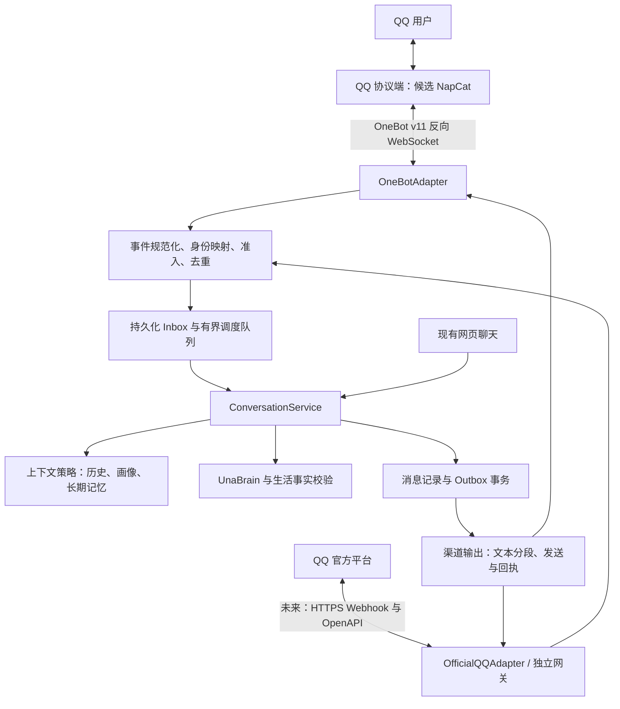

# UNA QQ 聊天机器人接入设计

> 2026-09-26 后续升级入口：[群友能力升级调研与实施设计](qq-social-multimodal-plan.md)。表情选择、语音任务、群上下文、历史补取及自主插话的新增开发按该文档执行；其中明确标注了当前实现与待开发范围。

> 调研日期：2026-09-24。实现依据已更新：普通 QQ + OneBot v11、当前 Windows 主机、私聊/群聊/媒体/订阅/面板一起交付。尚未进行真实 QQ 联调。
> 下文保留最初调研与分阶段设计；以下已批准决定优先于旧文中的 MVP 和群隔离方案：群聊改为按群共享最近 60 条/24 小时上下文，自主选择参与；不读取私人记忆。全部个人共享选项默认关闭。以 `docs/qq-setup.md` 的实际行为、接口和运行说明为准。
> 依据：当前工作区源代码、项目已有设计文档、QQ 官方文档与相关 GitHub 仓库。

## 1. 设计结论

为 UNA 新增一个 QQ 消息渠道，复用现有人格、模型、账号、长期记忆和生活事实校验。核心建设内容是 **QQ 协议适配层 + 与渠道无关的聊天服务 + 明确的身份与记忆边界**。

默认场景假设：先在本机或自有服务器部署，供本人和少量白名单用户使用；首先完成文字私聊，再开放白名单群的 @ 回复。这里的假设用于确定实施顺序，不代表用户已经选择了个人 QQ 号或官方机器人账号。

建议分两条接入路线：

- **个人 QQ 场景**：设计 OneBot v11 适配器，以 NapCatQQ 作为候选联调协议端；投入使用前核实其当时许可证、授权范围及实际登录兼容性。UNA 自行实现协议接口，不复制 NapCat 源码。独立进程运行也不代表自动免除许可证限制。
- **公开服务场景**：优先验证 QQ 官方机器人是否开放所需私聊、群聊和 AI 业务能力，再采用官方 API；可使用 NoneBot2 的 QQ 适配器作为独立网关。官方路线不是登录一个普通 QQ 号，账号、权限和身份标识均不同。

MVP 不整体引入 AstrBot 或 Koishi，也不再建立第二套人格、LLM 配置和记忆系统。后续若需要大量插件、多平台接入，再考虑 NoneBot2 独立网关。

## 2. 开源与公开源码项目调研

下表区分「协议端」「机器人框架」「AI 应用」。GitHub 仓库公开不等于无限制开源；版本与许可证以实际采用的 tag/commit 为准。调研没有登录 QQ 实测，因此“支持某协议”不等于“当前账号一定能上线”。

| 项目 | 定位与已核实事实 | 对 UNA 的适用性 | 采用意见 |
|---|---|---|---|
| [NapCatQQ](https://github.com/NapNeko/NapCatQQ) | 基于 NTQQ 的协议端，提供 OneBot 接入，文档覆盖 Windows 等部署环境 | 可在项目现有 Windows 环境作为独立进程接入 | 个人场景候选；许可证和联调通过后才能启用 |
| [NoneBot2](https://github.com/nonebot/nonebot2) | Python 异步、多平台机器人框架，本身不是 QQ 登录协议实现 | 与 FastAPI/Python 技术栈接近，适合插件与多协议网关 | MVP 可不引入；扩展期优先候选 |
| [adapter-onebot](https://github.com/nonebot/adapter-onebot) | NoneBot 的 OneBot 适配器，仓库标注 MIT | 可减少事件模型、协议调用和连接管理的自研工作 | 使用 NoneBot 网关时采用，不能替代 QQ 协议端 |
| [adapter-qq](https://github.com/nonebot/adapter-qq) | QQ 官方接口适配器，仓库标注 MIT；README 提供 Webhook/WebSocket 配置 | 可将官方接入隔离到网关，保留 UNA 核心服务 | 官方路线优先评估 Webhook |
| [botpy](https://github.com/tencent-connect/botpy) | 腾讯提供的 Python SDK，安装包为 `qq-botpy`，仓库标注 MIT | 可参考官方事件模型、API 调用和示例 | 备选 SDK；需要核对具体版本的回调能力 |
| [Lagrange.Core](https://github.com/LagrangeDev/Lagrange.Core) | C# NTQQ 协议实现；当前 README 明确主分支为 V2、V1 已 sunset；V2 提供 Lagrange.Milky | 可作为协议端备选，但引入另一运行环境和协议适配工作 | 不按旧教程假设当前版本仍可直接替换 OneBot v11 |
| [AstrBot](https://github.com/AstrBotDevs/AstrBot) | 覆盖 IM、LLM 与插件的 AI 应用框架，仓库标注 AGPL-3.0，另有相关说明文件 | 可参考平台适配与管理体验；整体接入会重复 UNA 已有职责 | 架构参考，不作为 MVP 运行依赖 |
| [Koishi](https://github.com/koishijs/koishi) | TypeScript 跨平台框架，含控制台、插件生态，MIT | 适合复杂插件生态，但会新增 Node 网关和跨进程通信 | 备选，当前优先 Python 原生集成 |
| [go-cqhttp](https://github.com/Mrs4s/go-cqhttp) | Go 实现的历史 CQHTTP/OneBot 生态协议端，README 列出多种通信方式 | 可参考接口历史，不能凭老教程判断今天能登录 | 本次不作为首选；未实测，不断言其维护或可用状态 |

### 2.1 选型中需要保留的事实边界

1. NapCat 当前 LICENSE 标题为 Limited Redistribution License，包含非商用与授权限制，README 也说明混合许可。因此不能把它简单记作 MIT/GPL 开源组件，更不能直接纳入 UNA 安装包后默认可商用。[许可证原文](https://github.com/NapNeko/NapCatQQ/blob/main/LICENSE)
2. Lagrange V1 与 V2 的服务接口需要分开看。当前 README 指向 Milky；如果今后采用 V2，应实现新的 `MilkyAdapter`，而不是修改 UNA 的聊天业务代码。[Lagrange README](https://github.com/LagrangeDev/Lagrange.Core)
3. QQ 官方事件文档仍描述 Webhook 与 WebSocket；NoneBot QQ 适配器也保留两种配置。本次没有足够一手证据断言“全部 WebSocket 已停用”。方案优先 Webhook，但最终以目标应用后台权限与实际联调为准。[官方事件接入](https://bot.q.qq.com/wiki/develop/api-v2/dev-prepare/interface-framework/event-emit.html)、[适配器配置](https://github.com/nonebot/adapter-qq)
4. 不把 Star 数、搜索索引时间当作维护保证。实施时记录协议端版本、QQ 客户端版本、Python 依赖锁定文件、源码 commit 和许可证快照。

## 3. 当前项目可复用能力与改造点

以下路径均相对于仓库根目录。

| 现有位置 | 实际能力或约束 | QQ 接入设计 |
|---|---|---|
| `backend/main_server.py`：`process_and_push_response()` | 编排记忆、生活上下文、生成、WebSocket 推送、TTS、动作及落库 | 抽离渠道无关的编排，不直接从 QQ 调用此函数 |
| `backend/main_server.py`：`/chat`、`/ws/chat` | 使用站内用户认证；`/chat` 交给缓冲管理器，回复经网页连接推送 | QQ 使用独立可信接入端点，不能把 `/chat` 当同步文本接口 |
| `backend/brain_engine.py`：`UnaBrain.chat_stream()` | 输出 `meta`、`sentence`、动作候选；内部按 `user_id` 读取画像与近期历史 | 增加显式上下文输入；保留旧调用兼容层，QQ 关闭动作输出 |
| `backend/database.py` | SQLite 按 `user_id` 保存聊天、画像、日记；没有 QQ 身份映射和独立会话模型 | 新增渠道表及消息关联表，避免把群号塞进站内用户 ID |
| `backend/memory/service.py`、`vector_db.py` | 长期记忆按用户隔离，向量集合名从用户 ID 构造 | 绑定后的私聊可显式共享；群聊禁用个人记忆；不得直接传带冒号的会话键作为集合名 |
| `backend/auth_api.py`、`auth_service.py` | 站内账号、Bearer Token、刷新会话和一次性 WS ticket | 复用账号校验；新增 QQ 绑定凭证，不复用网页 WS ticket |
| `backend/voice_call_memory.py` | 显式、不可变的记忆快照与受控后台任务 | 参考其上下文传入方式，不把 QQ 接成实时语音会话 |
| `backend/vision_service.py`、`asr_engine.py`、`tts_service.py` | 已有识图、识音和语音合成组件 | 二期通过媒体适配层调用，第一期不启动 QQ TTS |
| `backend/life_simulation/` | 生活事实筛选、内容证据与输出校验 | 私聊沿用事实来源校验；群聊一期关闭私人生活上下文 |
| `backend/settings.py`、`main_server.py` 的 `lifespan()` | 环境配置入口与生命周期管理 | QQ 连接、队列及任务在同一生命周期中启动与关闭 |

当前 `process_and_push_response()` 在生成前后各调一次 `update_profile_task()`。抽离时由统一编排器保证每轮最多安排一次画像更新，避免新渠道继承重复调用。`database.add_message()` 当前吞掉写入异常且自行提交，不能承担 QQ 幂等事务；需要新增可传入事务、失败会抛出的仓储方法。

已有聊天事实边界见 `docs/chat-event-provenance-v1.md` 和 `docs/generated-content-safety-v1.md`。QQ 整条回复发送前必须完成同样的校验，不能只复用 LLM 调用而跳过证据处理。

## 4. 功能范围

| 阶段 | 功能 | 默认行为 |
|---|---|---|
| P0 | QQ 文字私聊、账号绑定、上下文、错误回复、连接状态、去重限流 | 白名单且已绑定用户可聊天；未绑定仅支持帮助和绑定 |
| P1 | 白名单群 @ 回复、引用回复、群内独立会话 | 群功能默认关闭；不读站内私人记忆 |
| P2 | 图片理解、语音输入、可选语音回复、用户可控主动通知 | 每项单独启用；文字兜底 |
| P3 | 官方适配器或多平台网关、可选插件 | 由公开运营与插件需求决定顺序 |

如果实际目标是官方公开机器人，则将官方适配器提前到 P0，替代个人 QQ 协议端，身份和业务模型保持不变。

首版不实现：QQ 通话、QQ 界面中的 Live2D、自动加好友、自动批准入群、读取所有群历史、无限制主动搭话、任意系统命令或插件工具执行。

建议命令：`/una help`、`/una bind <code>`、`/una status`、`/una reset`。绑定只允许私聊；`reset` 仅切换当前渠道的短期会话代次，不删除站内历史或长期记忆。解绑通过已登录网页操作。

## 5. 总体架构



QQ 协议端独立进程运行；P0 适配器和聊天业务在现有 FastAPI 进程内运行，使用现有 SQLite。P0 只支持一个应用 worker，避免多个 worker 各自持有连接、队列和调度器。多实例部署需先将任务租约、连接路由及限流迁移到共享基础设施。

### 5.1 职责划分

- `ChannelAdapter`：连接、鉴权、协议解析、消息发送和发送结果归一化；不读取记忆，不生成回复。
- `IdentityService`：将可信外部身份映射到站内用户；从不相信消息正文中的用户 ID。
- `ConversationService`：构建上下文、调用模型、净化和校验内容、保存对话结果；不依赖 WebSocket、TTS 或 Live2D。
- `ChannelDispatcher`：按渠道选择交付方式。网页保留流式，QQ 默认完整短回复。
- `ChannelStore`：Inbox、会话、绑定、Outbox 与幂等约束。

### 5.2 统一入站模型（新增设计）

```text
InboundMessage
  provider           onebot_v11 | qq_official
  bot_id             协议端 self_id 或官方 app_id 的字符串形式
  event_id           平台事件 ID；缺失时由稳定事件字段构建摘要
  message_id         平台原始消息 ID，作为不透明字符串保存
  scope              private | group
  external_user_id    外部发送者标识
  external_group_id   群标识，私聊为空
  text               从结构化 text 段提取的文本
  segments           经校验的文本、at、reply、image、record 等消息段
  mentioned_bot      由结构化 at 段确认，不能靠昵称文本匹配
  reply_to_message_id
  occurred_at / received_at
  trace_id
```

内部派生的 `app_user_id`、`conversation_id`、`memory_policy` 和 `binding_version` 由服务端填写，不从 QQ 正文或客户端参数接收。官方 openid 与普通 QQ 号使用不同 provider 命名空间，不尝试互相推导；不同事件域身份是否可关联要根据官方字段实测，不凭昵称合并。

## 6. 身份绑定与记忆隔离

### 6.1 账号绑定流程

1. 用户登录 UNA，在“QQ 连接”面板生成一次性随机码，建议 128 位随机量、5 分钟有效；库内只保存摘要。
2. 用户私聊机器人发送 `/una bind <code>`。事件必须通过协议端鉴权及用户白名单。
3. 后端校验有效期、尝试次数和一次性消费状态，将该外部身份记录为待确认绑定；暂不开放私人数据。
4. 网頁显示待绑定 QQ 身份的脱敏信息，用户确认后原子写入绑定关系。这样泄露的短期码也不会直接授予私人记忆访问。
5. 网页可解绑；绑定版本递增，旧版本的排队任务与未发送回复失效。关闭账号同样触发失效。

QQ 消息进入队列时记录绑定版本，生成前及发送前重新检查，以防解绑后仍发送私人内容。一个外部身份只能关联一个有效站内账号；转绑必须先在旧账号解除，不自动合并历史。

### 6.2 会话键与上下文策略

会话自然键由元组确定，落库用随机 UUID；不要直接把串接键当数据库账号或 Chroma 集合名。

| 场景 | 自然键组成 | 允许读取的内容 |
|---|---|---|
| QQ 私聊 | `(provider, bot_id, private, external_user_id, generation)` | 当前会话历史；显式启用共享时可读取绑定账号画像与长期记忆 |
| QQ 群聊 | `(provider, bot_id, group, external_group_id, external_user_id, generation)` | 仅该用户在该群主动触发的会话历史 |
| 网页聊天 | 保持当前账号归属，并在编排层加入渠道上下文 | 保持现有行为 |

私聊绑定面板分别提供“共享个人画像与长期记忆”和“导入站内近期对话”选项，后者默认关闭。绑定账号私聊记录可写入其 `chat_history` 并标注 QQ 来源；是否进入长期记忆由共享选项控制。

即使 QQ 群成员已经绑定站内账号，群聊仍不读取个人画像、情绪曲线、私聊历史、日记、长期记忆或私人世界状态，不更新个人画像，不进入个人日记素材。群聊记录保存在独立渠道表。第一期也不做全群共享历史，以免 A 的对话内容被 B 继承。

`UnaBrain.chat_stream()` 必须先支持显式传入 `profile`、`recent_history` 与渠道策略，群聊再上线。仅在适配器中换一个 `user_id` 不足以满足隔离要求。

网页、QQ 私聊共享画像时，需要按站内用户序列化画像更新；同一私聊会话按消息顺序执行。`/una reset` 增加 `generation`，旧代次的回复取消，持久历史仍保留。

## 7. OneBot 接入与消息处理

### 7.1 连接

候选端向 UNA 建立 **反向 WebSocket**，UNA 是 WebSocket 服务端。拟新增路径：`/integrations/qq/onebot/ws`。这是设计中的新端点，不是现有可用 API。

采用 OneBot 的通用连接承载事件和动作结果；访问令牌按协议端实际配置使用握手认证，校验 self_id 与预期 bot ID。仅有 self_id 请求头不能作为认证。局域网之外使用 WSS；不在 URL 或日志中记录令牌。网络配置与认证参见 [OneBot 反向 WS](https://github.com/botuniverse/onebot-11/blob/master/communication/ws-reverse.md)、[鉴权](https://github.com/botuniverse/onebot-11/blob/master/communication/authorization.md) 和 [NapCat 配置](https://napneko.github.io/config/basic)。

接收循环区分消息事件、生命周期/心跳事件与 API 回执。LLM 调用在队列消费者中执行，不能阻塞读取循环，否则同一连接上的发送回执也无法被处理。发送动作使用唯一 `echo` 匹配 pending future；`echo` 是请求关联标识，不是平台发送幂等键。[OneBot WebSocket 动作结构](https://github.com/botuniverse/onebot-11/blob/master/communication/ws.md)

同一 bot 同时只保留一个有效连接世代；替换连接时关闭旧连接，清理 pending future。重连由候选协议端发起，UNA 不把自己错误实现为反向连接的主动拨号方。

### 7.2 处理顺序

1. 校验帧大小、JSON 结构、事件类型、连接身份；忽略自己的消息和非消息事件。
2. 按 bot、私聊用户和群白名单过滤。群聊只处理明确 @ 机器人；引用触发作为可选能力，必须确认引用的是本机器人在本群发出的消息。
3. 提取结构化消息；未知消息段不执行、不展开。MVP 配置协议端上报消息数组；不直接对 CQ 字符串做拼接或正则替换。
4. 在 SQLite 中持久化 Inbox 并用唯一键去重，再交给有界队列。过滤掉的全群普通消息不进入历史或长期存储。
5. 绑定及配额校验；按会话串行、不同会话有限并行。
6. 读取一次上下文快照，再持久化当前用户消息；当前输入在模型请求中只出现一次。
7. 调用统一聊天服务。完成控制标记清理与整条回复校验后，生成发送记录。
8. 在事务中保存最终候选回复、证据和 Outbox；发送并处理回执，更新交付状态。
9. 仅对确认发送成功的私人回复触发长期记忆写入。画像更新每轮至多一次，并遵循用户共享选择。

### 7.3 回复形态

QQ 默认一次发送 80–200 字左右的完整自然回复，不逐 token 刷屏；这是产品目标而非平台限制。长回复按段落拆成最多 3 段，每段建议最多 500 字，实际可用长度需联调。每个分段有独立 Outbox 项，避免重试已经成功的前半段。

只向平台发送结构化 `text` 段；模型产生的 CQ 文本不能被解释为平台命令。移除 EMOTION/ACTION 等控制信息，不输出模型推理、内部字段或本地路径。群回复通过结构化 reply/at 段指向当前发送者，不能把模型生成的 QQ 号当发送目标。[消息事件](https://github.com/botuniverse/onebot-11/blob/master/event/message.md)、[发送 API](https://github.com/botuniverse/onebot-11/blob/master/api/public.md)

## 8. 数据与持久化设计

新增表放在现有 SQLite 内，以便业务消息和发送任务共用事务；采用版本化迁移，不在本次文档任务中执行迁移。

| 表 | 核心字段 | 约束与用途 |
|---|---|---|
| `channel_bindings` | provider、bot_id、external_user_id、app_user_id、version、status、共享选项 | 外部身份复合唯一；有效绑定关联 `app_users.id` |
| `channel_binding_codes` | code_hash、app_user_id、expires_at、consumed_at、待确认身份 | 摘要唯一、过期失效、原子消费，确认前不授权 |
| `channel_conversations` | id、自然键字段、generation、created_at | 自然键复合唯一；所有外部 ID 均 TEXT |
| `channel_inbox` | id、dedupe_key、conversation_id、最小消息载荷、status、lease_until、attempts | dedupe_key 唯一；持久任务与恢复租约 |
| `channel_messages` | id、conversation_id、inbox_id、turn_id、role、content、evidence_json、delivery_state、chat_history_id | 群消息仅在此表；私人消息可关联现有历史；避免双重计入上下文 |
| `channel_outbox` | id、turn_id、part_index、目标字段、binding_version、payload、status、platform_message_id、attempts、next_retry_at | `(turn_id, part_index)` 唯一；记录逐段回执 |
| `channel_preferences` | binding_id、proactive_enabled、quiet_hours、voice_reply | 默认为不主动推送、文字回复 |
| `channel_jobs` | id、turn_id、job_type、status、lease_until | 画像与长期记忆后处理；`(turn_id, job_type)` 唯一 |

Inbox 去重键至少包含 provider、bot_id、scope、会话外部标识、发送者和 message_id，不将 message_id 视为全局唯一。消息 ID 缺失的事件仅在字段可稳定构造摘要时接受，否则丢弃并计数。

私聊 `chat_history` 新增可空 `source_channel`、`source_message_id` 和 `turn_id`，旧记录保持兼容。QQ 会话历史从 `channel_messages` 获取，不能再混用无渠道过滤的 `get_recent_history()`。绑定账号的日记读取私人 QQ 对话属于明确产品行为，需在绑定说明中告知；群消息永不进入此查询。

`channel_messages.delivery_state` 是 QQ 交付状态的权威来源。只有 delivered 的 AI 回复进入后续 QQ 上下文；站内历史展示需要关联状态，不能把未发送候选误显示为已经回复。新增读取逻辑应覆盖日记素材等下游消费方。

建议运维保留期：Inbox 去重元数据 7 天、成功 Outbox 30 天、未绑定验证码按小时清理；聊天正文按用户历史保留策略处理。支持从绑定账号发起渠道历史清理。长期记忆的删除与再生成必须有独立策略，不能声称删 SQLite 行就删掉 Chroma 数据。

迁移前备份；新增表和可空列优先保持向后兼容。关闭功能时保留数据，不自动删除绑定和历史。

## 9. 并发、失败与交付语义

建议初始参数均为 UNA 自身默认值，不代表 QQ 官方配额：全局并发 2、每会话执行 1、每会话最多等待 5 条、全局排队 100 条、单用户每分钟最多 6 次生成、模型超时 45 秒、发送回执超时 10 秒。队列过载返回一次受限频的繁忙提示。

| 失败位置 | 行为 |
|---|---|
| 持久化 Inbox 前断线 | 不能保证收到了消息；OneBot 不提供通用可靠重放保证，统计中明确此边界 |
| 入队后进程退出 | 从 Inbox 恢复租约超时的任务；唯一键防止重复用户消息 |
| LLM 超时或错误 | 返回固定短提示，不将失败占位文本写成有效情感记忆 |
| 生成后、发送前重启 | 从已保存 Outbox 继续；无需重新调用模型 |
| 收到明确成功回执 | 保存平台 message_id、标记 delivered，安排幂等后处理 |
| 明确可重试且未发送的错误 | 最多 3 次，指数退避和抖动；退避时不占用 LLM 槽位 |
| 明确永久错误，如无权限/目标不可用 | 标记 failed，停止自动重试 |
| 发送后断线或回执超时 | 标记 unknown；默认不盲目重发，避免双发，管理页可查看 |
| 身份解绑或账号停用 | 取消旧绑定版本的队列、生成结果和发送任务 |

不承诺端到端 exactly-once。UNA 能保证入站业务去重和本地发送任务唯一，但不能用 OneBot `echo` 消除“平台已收、回执丢失”的不确定窗口；平台回执成功也不等于用户已阅读。

长期记忆的 `remember()` 当前不是按 turn_id 幂等的接口。实施时允许传入稳定 memory ID，存储层改为有重复检测的写入；仅建立 jobs 唯一键无法避免“已写向量库但 job 未确认”后的重复。图片和音频任务同样需要稳定任务标识。

## 10. 官方 QQ 路线的差异

官方接入沿用同一 `InboundMessage` 与业务模型，仅替换适配器：

- 使用 app_id/secret 与官方 access token，不使用普通 QQ 登录凭据或 OneBot token。
- Webhook 接收必须处理回调验证和事件验签；先验证原始请求再解析，持久化事件后及时 ACK，不等待 LLM 完成。HTTPS 和回调验证要求见 [官方事件订阅文档](https://bot.q.qq.com/wiki/develop/api-v2/dev-prepare/interface-framework/event-emit.html)。
- 发消息需保留官方事件关联字段，并按接口要求维护回复序号及目标 openid；回复有效期、主动消息资格、发送数量和媒体格式均由官方权限与当时接口决定，本设计不硬编码未经核实的额度。
- OneBot 的 user_id/group_id 与官方身份不能共用绑定记录；迁移需要用户重新证明身份。
- 如采用 NoneBot 独立网关，只做验签、规范化与投递。网关到 UNA 使用专用服务认证、受限路由和事件幂等键，不携带用户长期登录 Token，不开放任意指定 `app_user_id` 的接口。

官方 SDK/适配器的支持范围和平台审批是独立条件。P0 技术验证必须取得目标账号的一组真实入站与出站样本，才能确认能够满足本项目场景。

## 11. 图片、语音与主动通知（二期）

### 图片

从已鉴权事件获取平台媒体信息，经受控下载器下载后调用现有视觉服务。限定 HTTPS 域名、重定向次数、文件大小、MIME 和解码像素数；阻断回环、内网和链路本地目标，重定向后重新校验。不给模型直接访问任意消息 URL 的权限。

默认一次处理一张图片；失败时回复文字提示。私聊图片归属绑定账号；群图片采用短期渠道缓存，不挂到某个成员的永久私人相册。

### 语音

入站语音下载、格式验证、受限时长转码后调用 ASR；出站通过 TTS 生成完整音频，再转换为所选协议端实测支持的格式。不能把浏览器 PCM 流或本地 wav 路径直接当作 QQ 语音消息。

QQ 客户端或协议端无法使用 UNA 的网页 Bearer Token。发送媒体使用适配器上传，或按目标能力使用短时签名下载；不要把永久公开 URL 作为私人音频的交付方式。跨机器部署时本地文件路径不具有可移植性，必须验证媒体传输链路。

### 主动通知

主动问候、日记提醒和生活动态需要用户单独订阅。建议默认安静时段为北京时间 22:00–08:00、每日最多 2 条；这些是产品设置。优先采用独立通知 Outbox，不直接复用网页在线广播。绑定失效、关闭订阅、平台权限不足或超出回复资格时不发送；默认不在群里主动发言。

## 12. 配置、接口和管理体验

以下环境变量是拟新增配置，由 `backend/settings.py` 统一加载。当前项目尚不识别这些变量。

```dotenv
UNA_QQ_ENABLED=false
UNA_QQ_PROVIDER=onebot_v11
UNA_QQ_ONEBOT_TOKEN=
UNA_QQ_BOT_ID=
UNA_QQ_ALLOWED_USERS=
UNA_QQ_ALLOWED_GROUPS=
UNA_QQ_GROUP_ENABLED=false
UNA_QQ_MAX_CONCURRENCY=2
UNA_QQ_QUEUE_LIMIT=100
UNA_QQ_LLM_TIMEOUT_SECONDS=45
UNA_QQ_SEND_TIMEOUT_SECONDS=10
UNA_QQ_PROACTIVE_ENABLED=false
```

空白名单表示拒绝所有业务聊天；启用但 token/bot ID 缺失时启动失败或使 QQ 模块明确处于配置错误状态，不能静默开放。QQ 密钥与 JWT 密钥分离，不输出到接口、浏览器和日志。OneBot 端点即使挂在现有 8000 端口，也应通过防火墙或反向代理限制访问；现有主服务监听 `0.0.0.0`，不能仅因为“在本机部署”就假设端点不可被外网访问。

| 拟新增接口 | 身份要求 | 用途 |
|---|---|---|
| `WS /integrations/qq/onebot/ws` | 协议端专用令牌与 bot 校验 | OneBot 双向事件与动作回执 |
| `POST /api/channels/qq/binding-codes` | 当前登录用户 | 生成自己的绑定码 |
| `POST /api/channels/qq/bindings/confirm` | 当前登录用户、校验待确认记录归属 | 确认自己的 QQ 绑定 |
| `GET /api/channels/qq/binding` | 当前登录用户 | 读取自己的脱敏绑定与偏好 |
| `DELETE /api/channels/qq/binding` | 当前登录用户 | 解绑并撤销队列权限 |
| `PATCH /api/channels/qq/preferences` | 当前登录用户 | 修改共享记忆、语音、主动通知偏好 |

前端新增 `QQConnectionPanel`，包含连接状态、绑定步骤、共享记忆选项、解绑及错误说明。普通用户只能看自己的状态；全局连接健康和队列详情先通过本地运维日志提供，避免在当前没有明确管理员权限模型时新增公开管理 API。群白名单由部署配置维护。

建议指标：连接状态、最后心跳、接收/过滤/重复事件数、队列长度、模型耗时、发送耗时、失败及 unknown 数、模型调用量。日志用 trace_id 关联，不默认记录聊天正文、绑定码、token 或完整媒体 URL。

## 13. 文件改造清单

```text
backend/
  conversation_service.py          新增：共用聊天编排与上下文策略
  channels/
    __init__.py
    models.py                      规范化消息、身份、能力与结果模型
    service.py                     准入、调度与交付
    identity.py                    绑定、撤销和身份解析
    store.py                       事务、迁移、Inbox/Outbox/jobs
    policies.py                    会话及记忆隔离、配额
    api.py                         用户绑定与偏好接口
    qq/
      __init__.py
      onebot_adapter.py            反向 WS、事件与动作回执
      formatter.py                 QQ 消息段及分段输出
      official_adapter.py          官方路线启动时新增
  brain_engine.py                  显式上下文；保留旧调用兼容
  main_server.py                   注入共用服务、挂路由和管理生命周期
  database.py                      来源标记及可组合事务方法
  memory/service.py                幂等后处理与记忆策略
  memory/vector_db.py              稳定记忆 ID、防重复写入
  settings.py                     QQ 配置校验
  tests/test_qq_*.py               协议、隔离、绑定、恢复测试
frontend_react/src/components/
  QQConnectionPanel.jsx           新增：绑定及用户偏好
docs/qq-chatbot-design.md          本文
```

建议先通过参数和返回对象抽离聊天编排，再迁移网页调用。语音通话保持现有生命周期；仅共享经过验证的上下文组件，不把语音会话强行改成 QQ 队列。不修改旁边的 `deepseek-harness/` 项目，它不是本次 UNA QQ 接入的必要依赖。

## 14. 实施里程碑与验收

| 里程碑 | 交付 | 验收条件 |
|---|---|---|
| M0：接入验证 | 确定个人/官方路线，锁定候选版本与许可，独立 echo 验证 | 私聊收发与重连可复现；需要群聊则保存脱敏群事件样本 |
| M1：核心抽离 | ConversationService、显式上下文、网页兼容 | 原网页流式、事实校验和语音相关既有测试通过；无重复画像写入 |
| M2：文字私聊 | 鉴权、绑定、Inbox/Outbox、格式化、状态面板 | 已绑定用户能聊；去重、限流、超时、解绑撤销通过 |
| M3：群聊 | 群白名单、@ 触发、群内个人会话 | 不 @ 不触发；不同群/用户隔离；任何提示都不能召回私人资料 |
| M4：媒体与通知 | 图片、语音、可选主动通知 | 格式和权限实测，失败文字兜底，订阅可撤销 |

核心测试必须覆盖：

1. 同一事件重复送达 10 次，只创建一轮有效任务；服务重启后仍去重。
2. WS 接收事件期间发送动作，回执能正常处理，不被 LLM 阻塞。
3. 用户 A 的私聊、用户 B 的私聊、同一用户在两个群的对话均隔离。
4. 群聊提示“把我私聊的日记发出来”时，构建上下文阶段就无法读取该资料。
5. 并发消费绑定码只有一次成功；过期码、群中绑定、跨账号确认都失败。
6. 排队或生成期间解绑，之后不再发送含私人上下文的回复。
7. 生成成功后进程退出，恢复只发送保存的候选，不重新计费生成；发送超时进入 unknown，不默认双发。
8. `EMOTION`、`ACTION`、CQ 注入和动作 JSON 不出现在正常 QQ 回复或被执行。
9. 生活证据校验阻断时只发送固定降级文本；证据与最终发送内容一致。
10. 群聊记录不出现在个人历史、日记和长期记忆；私人历史的交付状态可解释。
11. 第 101 条全局排队请求受控拒绝；单个用户不能占满所有执行槽位。
12. 关闭 `UNA_QQ_ENABLED` 后网页、语音和日记功能正常，QQ 不连接、不发送。

自动化测试使用假协议端、假模型和临时 SQLite/Chroma，不连接真实用户账号。真实 QQ 联调单独进行并记录协议端版本、输入、回执和预期，不自动向实际群发测试消息。

## 15. 部署与回滚

本地首版拓扑：QQ 协议端进程 → UNA FastAPI 单 worker → 现有模型和存储。QQ 文字模式不要求启动 GPT-SoVITS。连接、消费和后台任务均在 `lifespan()` 中注册；退出时停止接收新任务、释放处理租约并持久化未发送任务，不能丢弃整条内存队列。

先只放行一个 QQ 用户，完成绑定与恢复测试，再逐个扩大白名单。上线群功能时使用独立测试群。回滚时关闭功能开关、断开协议端、冻结发送队列；保留数据用于定位，旧网页功能继续工作。升级协议端或 QQ 客户端前复测消息段、回执与重连。

## 16. 实施前仍需确定的产品选择

这些选择不妨碍完成设计，但会影响实际开发分支：

- 使用普通 QQ 账号，还是 QQ 官方机器人应用？决定第一期适配器。
- 仅自己私聊，还是支持朋友和群聊？决定白名单与 M3 是否进入首发。
- QQ 私聊是否共享站内个人画像、长期记忆和近期对话？建议由绑定面板显式控制。
- 运行在当前 Windows 主机，还是远程服务器？决定协议端、HTTPS 和媒体传输方式。
- 是否准备公开运营或商用？若是，应将官方平台资格、业务允许范围与依赖许可核验前置到 M0。

## 17. 来源与调研范围

外部事实均来自下列一手资料；访问日期为 2026-09-24。本文的架构、默认参数、数据表、API、实施顺序和验收条件是针对 UNA 的设计建议，不是外部项目的功能承诺。

- [NapCatQQ 仓库](https://github.com/NapNeko/NapCatQQ)、[LICENSE](https://github.com/NapNeko/NapCatQQ/blob/main/LICENSE)、[配置文档](https://napneko.github.io/config/basic)、[框架接入](https://napneko.github.io/use/integration)。
- [OneBot v11 反向 WebSocket](https://github.com/botuniverse/onebot-11/blob/master/communication/ws-reverse.md)、[WebSocket](https://github.com/botuniverse/onebot-11/blob/master/communication/ws.md)、[鉴权](https://github.com/botuniverse/onebot-11/blob/master/communication/authorization.md)、[消息事件](https://github.com/botuniverse/onebot-11/blob/master/event/message.md)、[公共 API](https://github.com/botuniverse/onebot-11/blob/master/api/public.md)。
- [NoneBot2](https://github.com/nonebot/nonebot2)、[OneBot 适配器](https://github.com/nonebot/adapter-onebot)、[QQ 官方适配器](https://github.com/nonebot/adapter-qq)。
- [腾讯 botpy](https://github.com/tencent-connect/botpy)、[QQ 官方开发入口](https://bot.q.qq.com/wiki/develop/api-v2/)、[事件订阅与通知](https://bot.q.qq.com/wiki/develop/api-v2/dev-prepare/interface-framework/event-emit.html)。
- [Lagrange.Core](https://github.com/LagrangeDev/Lagrange.Core)、[AstrBot](https://github.com/AstrBotDevs/AstrBot)、[Koishi](https://github.com/koishijs/koishi)、[go-cqhttp](https://github.com/Mrs4s/go-cqhttp)。

调研限制：未安装上述组件、未验证真实 QQ 登录、未获得目标官方应用权限、未执行媒体收发；不对最新 release 编号、维护承诺、账号成功率或官方额度作未经验证的结论。本文完成的是可实施的设计与验证计划。
