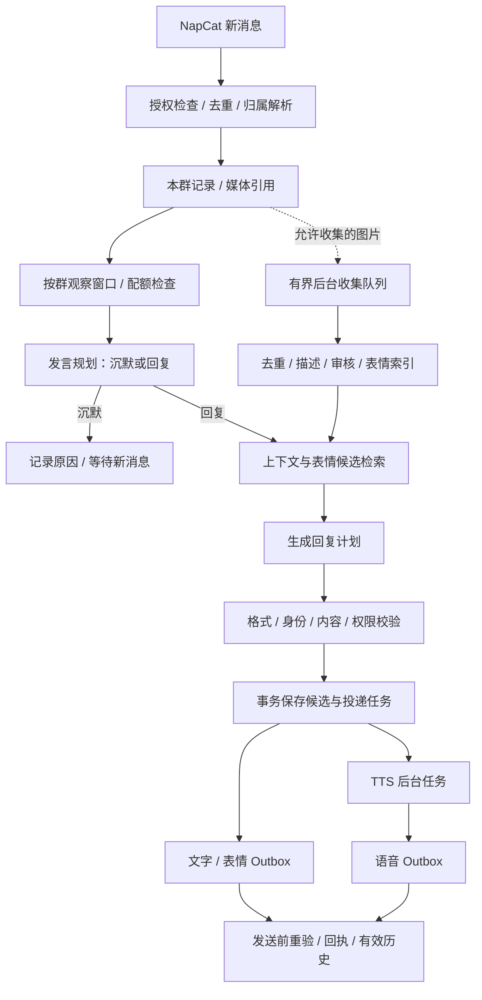

# UNA QQ 群友能力升级：调研与实施设计

日期：2026-09-26  
工作区：`D:\ai\Una\.worktrees\qq-chatbot\Una`，分支 `codex/qq-chatbot`。  
状态：后续开发基准；除第 3 节控制字段修复外，本文新增能力尚未实现。本文优先于旧设计中与表情、群聊触发、媒体关联和聊天记录读取有关的建议；绑定、认证、私人数据隔离、可靠投递继续遵守原设计。

## 1. 要做成什么样

UNA 能读懂本群最近在聊什么，判断是否值得接话，选择文字、表情包或语音来表达。群友不用每次 @；没有合适的话可说就保持沉默。上百上千成员仍按稳定 ID 区分，昵称只是显示名。

- **自由选表情包**：从可扩充的图库按语境选择具体图片，不把“开心”写死成一张图，也不把随机抽图当理解语境。支持纯表情和文字搭配表情。
- **发送语音**：复用 UNA 的 TTS，可按用户请求、私聊偏好、群设置决定。语音任务不能拖住文字回复。
- **读取聊天记录**：持续接收并保存授权群的新消息，检索本群保留期内记录；管理员可手动补取协议端实际可读的近期记录。
- **自然插话**：新消息触发观察，合并短时间消息，再结合发送者、引用和话题决定回复对象与内容，不靠随机概率直接发言。
- **正文干净**：控制字段、表情 ID、工具参数不进入 QQ 消息、TTS 或有效对话历史。

继续使用 UNA + NapCat/OneBot，不部署另一套 MaiBot 或 AstrBot，不安装其插件到 UNA。两者用于架构与交互参考，本次不复制它们的代码。

## 2. 调研结果与取舍

资料核验日期为本文日期。GitHub 主分支和在线文档会变化，以下是已读页面所描述的能力，不代表已在本机安装或实测。社区插件与框架核心能力分开记录。

| 来源 | 已核实内容 | UNA 借鉴点 |
|---|---|---|
| [MaiBot 主仓库](https://github.com/Mai-with-u/MaiBot) | 强调群友式交互与合适时机发言；仓库标注 GPL-3.0 | 保留自然人设，发言时机单独决策 |
| [MaiBot 配置文档](https://docs.mai-mai.org/manual/configuration/bot-config) | 有发言频率、提及触发、上下文条数、表情自动收集、图库容量和候选数量配置 | 观察与回复分开；表情有收集、筛选、清理生命周期 |
| [MaiBot 模型任务文档](https://docs.mai-mai.org/en/manual/configuration/model-config) | 区分 planner、replyer、emoji、vlm、voice 等任务；emoji 从候选中选合适图片 | 明确规划、生成、检索和媒体处理职责，不要求每个职责新建一个服务 |
| [MaiBot 表情管理 API](https://docs.mai-mai.org/develop/webui-api/data-and-memory-api) | 表情可上传、注册、封禁、预览并查看使用情况 | 需要人工纠错入口，模型不能决定一切 |
| [AstrBot 主仓库](https://github.com/AstrBotDevs/AstrBot) | 多平台、模型、插件与管理框架；仓库标注 AGPL-3.0 | 参考消息组件与能力配置，不整体引入第二套运行时 |
| [AstrBot 配置说明](https://github.com/AstrBotDevs/AstrBot/wiki/en-dev-astrbot-config) | 支持群记录注入、概率式主动回复、STT/TTS 与文字语音双输出 | 借鉴独立开关和双输出；UNA 不直接照搬概率式插话 |
| [AstrBot 消息发送文档](https://docs.astrbot.app/dev/star/guides/send-message.html) | 使用消息链及不同消息组件组织发送 | 统一文字、图片、语音的内部输出结构 |
| [社区 meme_manager](https://github.com/anka-afk/astrbot_plugin_meme_manager/blob/main/README.md) | 当前 README 描述分类与语义模式、图片描述和向量、自动收集与审核；首次没有内置图片 | “可扩充图库 + 语义候选 + 模型选择”，不要求每句固定配图 |
| [meme_manager 开发说明](https://github.com/anka-afk/astrbot_plugin_meme_manager/blob/main/DEVELOPMENT.md) | 有图片处理队列、管理接口和消息管线集成说明 | 收集不阻塞聊天；自发回复也必须走统一出口 |
| [社区 proactive_chat](https://github.com/Pancakes-Labs/astrbot_plugin_proactive_chat/blob/main/README_EN.md) | 描述主动任务持久化、静默时段和 TTS 集成 | 借鉴恢复和配额；不采用沉默群定时找话题的行为 |
| [NapCat API](https://napneko.github.io/onebot/api) | 列出 `send_group_msg`、`get_group_msg_history` 等接口 | 适配器负责收发和可选历史获取 |

资料存在版本差异。例如旧桥接插件的 README 说 meme_manager 不支持自动收集，但当前 meme_manager 自己的 README 已描述自动收集，本文以项目自身当前资料为准。历史读取也不能承诺“拿到手机里的全部记录”：NapCat 有[离线消息读取不完整的报告](https://github.com/NapNeko/NapCatQQ/issues/1838)，该报告不等同于当前所有版本都失败，必须联调确认。

开源许可证是仓库事实，不是可任意复制的许可。后续如果改为引入代码或素材，应另行记录具体版本、许可证、来源与署名；本设计不将第三方源码或图库打包进 UNA。

## 3. 当前代码基础与本轮立即修复

| 模块 | 当前状态 | 缺口 |
|---|---|---|
| `channels/adapter.py`、`identity.py` | 解析发送者、@、引用；群内稳定身份 | 历史补取与媒体引用需要同样的归属校验 |
| `channels/store.py` | Inbox/Outbox、版本失效、群历史最近 60 条且 24 小时内 | 尚无表情资产、话题观察窗口、完整多媒体投递计划 |
| `channels/service.py` | 普通群消息已有 3 秒合并等待、相关性判断；自主回复至少 180 秒间隔、每小时最多 6 次 | 连续来消息可能一直等待；发送前出现任意新消息就取消，过于保守；TTS 尚占用该会话生成任务 |
| `conversation_service.py` | 生成、全文清洗、授权上下文、事实校验 | 判断器只返回布尔值，无法解释回复对象、表达方式及不发言原因 |
| `channels/media.py` | 当前图片直传、ASR、TTS、下载与解码限制 | 没有图库选图；跨消息图片引用未完成；真实图片下载曾受代理 Fake-IP 影响 |
| QQ 管理页面 | 绑定、偏好、群启停和活跃度基础入口 | 表情库、语音诊断、历史管理、插话原因需要扩展 |

### 本轮已修复：`MOOD: 0` 出现在正文

截图中的模型输出出现了独立的 `MOOD: 0`，旧清洗器主要按完整 `EMOTION: … | MOOD: …` 识别，漏掉独立字段。

本轮修改 `backend/chat_control.py`：支持独立 MOOD 头、大小写和全角冒号、带符号数字、方括号数值、与正文粘连，以及任意流式分片。QQ 提示词同时强调控制字段不进入正文。正常讨论“这个 MOOD: 0 表示什么”仍保留。

自动化验证：`test_chat_control.py`、`test_qq_channels.py`、`test_qq_identity.py`、`test_brain_engine.py` 共 75 项通过；补充 `test_main_server_delivery_boundaries.py`、`test_tts_service.py`、`test_voice_call_tts.py` 41 项通过，合计 **116 项通过**。测试使用模拟模型和临时数据库，包括清洗后的内容进入 TTS、历史和 Outbox 的检查，以及网页投递与实时语音回归。运行中的 UNA 需要重启后加载 Python 修复；不会撤回已经发出的消息，也不批量修改用户历史。

## 4. 整体架构



所有通道复用一个 QQ 发送出口。规划器不能直接访问文件、调用 NapCat 或发送消息。模型只提出选择，应用层负责执行、权限和额度。

## 5. 群记录、身份与上下文

### 5.1 三种记录来源

1. **在线接收**：白名单且启用的群中，新消息先保存再判断是否回复，包括没有 @ 的消息。
2. **本地检索**：重启后从本工作区 QQ 数据库读取保留期内记录；不读取主工作区或站内私人聊天。
3. **手动补取近期记录**：管理员在该群页面点击“补取最近记录”，单次最多 100 条、最多回溯 24 小时，通过 `get_group_msg_history` 读取协议端实际返回内容。无接口、超时、数据不完整时显示具体状态，不宣称已读完整历史。默认不在启动时自动补取。

补取任务持久化，按 `(bot_id, group_id, platform_message_id)` 幂等写入，保留原消息时间与 `source=backfill`。补取消息不触发回复、不收集表情、不重新发送旧问候，不进入实时未读计数。禁止扫描 QQ 本地文件夹或导入群成员私聊。

### 5.2 默认边界

- 群原始消息保留 **24 小时、每群最多 1000 条，任一上限到达即裁剪**；此为扩展后的设计值，当前模型历史仍为 60 条。
- 每次生成默认取最近 60 条，管理员可在 20～200 条间调整；额外按当前话题取最多 10 条相关记录，总上下文预算默认 6000 tokens。
- 超预算先删低相关旧消息，保留当前触发、引用原文和归属。单条异常长文本也截断并标明；不无限扩大模型窗口。
- 所有检索、摘要和缓存键包含 bot、group、conversation generation。摘要必须保留来源消息 ID 和 speaker ID，不建立群成员私人画像。
- 摘要、检索索引及 Inbox 中原始负载遵循同一保留期；过期投递诊断只保留状态和耗时等最小元数据。清理不能只删 `qq_messages` 而遗留可读原文。
- 清空群上下文时递增 generation，失效排队计划、摘要和媒体关联；表情库为单独资源，清空聊天不等于清空管理员维护的图库。

### 5.3 归属与媒体

沿用结构化 `speaker.id`、`display_name`、`message_id`、`reply_to`、`mentions`。同名不同号、改名、千人群都用 ID 判断；“他”指代不明确时不猜。

图片和语音占位必须带 `asset_ref`、原发送者与原消息 ID。明确询问某张图时，优先取同群被引用的图片；没有引用时，只在当前发送者最近 2 分钟且只有一条候选图片消息时关联。存在多张候选就询问，不把别人的图当作当前用户发的图。单次仍最多处理 3 张图片。

普通群消息默认不逐张识图、不逐条 ASR。启用表情收集是独立的、有预算的媒体处理选项。引用记录超出保留期或资源过期时明确说明无法取得原图。

## 6. 自主插话：何时说、对谁说

### 6.1 调度

- 明确 @ 或引用 UNA 的消息优先进入回复队列；仍受总发送配额约束。
- 普通群消息进入同群观察窗口：从首条消息起，安静 3 秒后评估；持续有新消息时最多等 8 秒，避免活跃群永远无法触发。
- 窗口冻结 `snapshot_end_id`，后来的消息进入下一个窗口；同一群只有一个规划/生成任务，全局继续有界并发。重复输入不重复评估。
- 名字提及、接续 UNA 的话题、群内公开提问可提高相关性，但不是关键词命中就直接发送。
- 只在新消息到达后考虑插话。冷场时不启动定时找话题任务；其他机器人回声与 UNA 自消息不得触发循环。

### 6.2 规划输出

规划器读取窗口、本群相关上下文、最近 UNA 发言及配额，输出经过严格类型校验的 JSON：

```json
{
  "decision": "reply",
  "reason_code": "can_help",
  "target_message_id": "123456",
  "context_message_ids": ["123452", "123456"],
  "preferred_mode": "text_sticker",
  "sticker_query": "嘴硬认输，轻松互损"
}
```

`decision` 只允许 `reply/silence`；理由为有限枚举：`direct_question/topic_followup/can_help/natural_banter/not_relevant/conflict/too_recent/no_new_information`。理由只用于诊断，不要求或记录模型思维链。目标和上下文 ID 必须来自当前群的可见快照。

闲聊不靠随机数做最终判断。旁人的争执、两个人的私密交流、重复话题、没有新增信息时优先沉默。模型失败、JSON 无效或规划超过 8 秒，普通插话本轮安静跳过；直接提问返回简短失败提示。

### 6.3 频率与过时判断

- 保留自主发言默认限制：至少间隔 180 秒，每小时最多 6 次。名字提及和无 @ 跟聊仍算自主发言，不能借语义判断绕过额度。
- @ 与引用回复不占自主额度，但所有模式共享按群、按用户及机器人总额度。文字、图片、语音组合算一次互动，各平台发送动作另有限速。
- 配额先事务预留，成功发送或回执 unknown 后占用；仅确认未发送的取消才释放。重启不能清空额度。
- 普通计划从触发快照起最多有效 60 秒。发送前比较新消息：明确换话题、目标被撤回、已有人完整回答或设置改变则取消。
- 不再因“群里多了一条消息”一律取消。新消息与原话题连续时，允许一次有界重评估；一次仍拿不准就取消，不循环重新生成。
- 文案生成后再次检查群启用、权限版本、generation、话题有效期和额度，避免停用后补发。

## 7. 表情包：自动扩充，按情境选择

### 7.1 图从哪里来

支持管理员上传、自有素材目录导入、在明确启用收集的白名单群中学习表情。无需预设固定图库，但冷启动没有图片时只能先用文字；不会凭空造出不存在的图片。

自动收集默认关闭，按群开启。来源群素材默认仅该群可用；管理员主动加入“公共图库”的素材才跨群使用。私聊图片不自动加入群图库。

收集过程：来源检查 → 受限下载 → 格式/大小/像素/动画限制 → SHA-256 去重 → 判断是否为表情 → 生成描述与 OCR 文本 → 待审核 → 可用索引。普通照片、聊天截图、二维码和包含明显个人资料的图默认排除，低置信度进入待审核，不自动公开。

默认人工审核，可按群选择“高置信度自动接收，其他待审核”。被拒绝并标为不再收集的内容保留哈希墓碑，避免重复骚扰。模型产生的描述、OCR 与标签均视为数据，不能成为系统指令。

### 7.2 如何选图

每张资产存自由描述、画面文字、表达意图、适用/不适用场景、来源范围与使用统计。标签不是有限的固定情绪名单。

1. 从回复意图、目标消息和局部上下文生成检索词。
2. 先按可见范围、可用状态和冷却筛选，再用描述语义相似度召回最多 12 张。
3. 向量模型优先复用现有可用的嵌入服务，使用独立 QQ 表情命名空间；未配置时用中文二/三字片段索引召回，不假设聊天模型具有 embedding API。
4. 在一次回复生成中提供候选 ID、简短描述和使用场景，由模型选具体 ID 或 `null`。置信不足时可对前 3 张缩略图追加一次视觉复核，超时就不配图。
5. 应用层校验 ID 属于本轮候选集、该群可访问且文件存在；禁止模型返回任意路径、URL 或自己编造资产 ID。

同一图在同群最近 20 次机器人互动内避免重复；没有新图就不发，不为完成配图硬选。每次最多一张表情；默认表情至少间隔 60 秒、每群每小时最多 10 张，并同时服从自主插话配额。具体数值可在面板调整但不能关闭总限流。

### 7.3 输出与素材约束

- 支持文字、文字＋表情、纯表情。纯表情交付后的历史写入该资产的受信描述，如“UNA 发了一个表示认栽的表情”，不写虚构正文。
- 一般文字先发、图片后发；图片失败不重发已成功文字。纯表情失败时，仅在明确未发送且本轮仍有效时降级短文字；unknown 不自动补发。
- PNG/JPEG/WebP/GIF；单张收集上限 5 MB、20 MP；动画最多 100 帧、总解码预算 100 MP，超限拒收。视觉索引只抽取至多 3 帧，发送保留通过检查的原动画文件。
- 初始全局图库上限 500 张或 500 MB，单群待审核上限 100 张；待审核 7 天过期，禁用素材 30 天后清理，用户固定的可用素材不因使用次数少而悄悄删除。
- 模型选图不等于实时联网搜图。第一版不开放任意网站抓图，也不新增 AI 生图服务；以后有需要另立扩展，避免给每次聊天增加网络检索和生图延迟。

## 8. 语音发送

复用现有 `tts_service.py` 和 `QQMedia.synthesize()`，不重新下载一套模型；QQ 不执行唇形分析。人格决定文字风格，TTS 的实际音色与情绪能力由现有服务决定，不能仅凭提示词承诺声音也会变成指定风格。

| 场景 | 默认行为 |
|---|---|
| 私聊文本或图片 | 文字；用户可选始终附语音 |
| 私聊语音 | 文字＋语音，延续 follow 偏好 |
| 群聊明确要求“用语音说/读给我听/语音回复” | 群语音开关允许时发送文字＋语音 |
| 普通群聊插话 | 默认文字或表情，不突然播语音 |
| 群管理员开启“允许自主语音” | 规划器可选语音，每群至少 10 分钟间隔、每小时最多 2 条；仍占原自主额度 |

将当前关键词判断升级为受限表达意图字段；不得因引用别人的“语音回复”四个字就误触发。用户正在讨论语音设置也不算请求朗读。

TTS 任务与文字事务一起持久化，独立 worker 执行，不再占着该群生成槽。输入只用已清洗、已验证的最终正文，不朗读 ID、标签、MOOD、URL 参数和代码块。最多 120 个中文字、20 秒音频，超长回复默认文字；模型不能通过删掉重要内容硬凑语音。

合成等待上限 45 秒，后台阻塞任务未退出前不能释放实际推理槽；成功后还需检查权限、话题有效期和文本投递结果。文字已发而音频失败时只记录音频失败，明确请求语音者可得到一次短提示，不再重复正文。

同机 NapCat 只读取 UNA 专用生成目录中的已校验文件，禁止任意本地路径和公开私人媒体目录。语音为 OneBot `record` 段，必须在真实手机 QQ 测试可播放、时长、音质和 NapCat 转码兼容性；生成 WAV 不等于 QQ 语音已可用。

## 9. 统一回复计划与可靠投递

后续将 QQ 的控制行输出迁移为内部 `ReplyPlan`。网页现有流式 EMOTION/ACTION 协议保留。

```json
{
  "schema_version": 1,
  "text": "……这次算你的，别得意太早呀。",
  "emotion": "playful",
  "sticker_id": "asset_abc",
  "voice": false,
  "reply_to_message_id": "123456"
}
```

以上是内部数据，不是 QQ 展示正文。模型输出严格校验字段、长度、枚举与候选范围；未知字段拒绝。应用生成 plan ID、有效期和版本号，模型不能延长过期时间。旧控制行兼容层在迁移期保留，截图修复不等本次架构升级。

- reply、sticker、audio 有独立状态与统一 `interaction_id`，唯一键为 `(interaction_id, kind, part_index)`。
- 状态流为 `pending → sending → delivered / failed / unknown`，另有 cancelled/expired。只有明确离线且未发送可自动重试。
- 语音依赖文字交付；文字＋图的图片依赖首条文字交付。纯图不要求不存在的文字前置条件。
- 部分成功分别计入有效历史：发出的文字有效，失败图片不算“看过/发过”；候选生成不等于实际交流。
- 发送前进行最后一次群版本、资源版本、generation 与 TTL 检查。撤销分享、停用、删除素材使尚未交付部分失效。
- 进程在发送后、回执保存前崩溃，恢复为 unknown，不盲目重发；不承诺平台不支持幂等键时的严格 exactly-once。
- 原因码、候选 ID 和投递状态进入管理诊断；模型原始输出、下载签名 URL、密钥不进入面向群友的消息。

## 10. 存储与接口改动

SQLite 采用递增版本迁移，以下为逻辑结构；实施时从实际 schema 版本继续，不硬编码假设下一版本必为 3。迁移只作用于本工作区 QQ 数据库，先备份，临时数据库上验证旧版本升级与重复启动。

| 表/改动 | 关键字段与约束 |
|---|---|
| `qq_group_windows` | bot/group/generation、首条时间、快照截止、评估状态；每群至多一个活跃窗口 |
| `qq_group_decisions` | 快照 ID 唯一、reason_code、目标消息、配置版本、耗时、取消原因；不存思维链 |
| `qq_media_assets` | ID、sha256、格式、大小、存储键、描述、OCR、状态、版本；原文件目录独立 |
| `qq_asset_scopes` | 资产与 group/public 可见范围、来源、审核状态；相同内容去重不等于跨群授权 |
| `qq_asset_indexes` | 资产版本、描述/embedding 模型版本、检索数据；变更后可重建 |
| `qq_media_jobs` | 入库/描述/索引/TTS 任务、稳定 dedupe key、租约、尝试次数、期限、取消版本 |
| `qq_reply_plans` | interaction ID、目标、快照、经验证计划、状态、权限/generation 版本、expires |
| 扩展 `qq_outbox` | interaction_id、kind=text/image/audio、part_index、依赖、asset版本、platform_id |
| `qq_quota_reservations` | 群/全局额度、时间窗、interaction ID 唯一、reserved/consumed/released |
| `qq_history_sync_jobs` | 群、时间范围、count、状态、实际获取数、能力错误；不得触发发送 |
| 扩展群设置 | 自主回复、窗口/上下文预算、表情发送与收集、语音策略、设置 version |

已有消息表继续承载归属，不能建立第二套互不一致的聊天历史。所有资源目录置于 `.qq-data`，原主实例数据不迁入。

API 保持 `/api/channels/qq/` 前缀和站内认证。以下新接口限部署配置中的管理员，群参数必须在环境白名单内：

- `GET/PATCH admin/groups/{group_id}/behavior`：群行为开关与频率，修改递增版本。
- `GET admin/groups/{group_id}/decisions`：分页原因、等待/沉默/取消与耗时。
- `GET admin/groups/{group_id}/history`：本群保留期内分页记录。
- `POST admin/groups/{group_id}/history-sync`：手动补取，返回后台任务 ID。
- `DELETE admin/groups/{group_id}/context`：清理上下文并失效旧任务。
- `GET/POST admin/stickers`：筛选与上传；上传数量、扩展名、真实格式均限制。
- `PATCH/DELETE admin/stickers/{id}`：描述、作用域、接收/拒绝/禁用/删除，作用域变更重新校验。
- `POST admin/stickers/{id}/reindex`、`GET admin/media-jobs`：异步索引与失败诊断。
- 预览通过站内认证接口按 asset ID 读取，不把 `.qq-data` 挂成公开静态目录。

普通用户仅管理自己原有绑定与语音偏好，不能浏览整群日志或别人的素材。页面清楚区分“启用自主回复”“允许配表情”“收集群表情”“允许自主语音”，不能用一个开关隐含开启所有能力。

## 11. 性能、网络与失败行为

- 群文字正常路径：直接询问一次生成；自主插话最多一次判断＋一次生成。素材识图/向量在后台完成，禁止每次把全图库发给模型。
- 初始预算：每群收集识图最多 20 张/天，全局 100 张/天；同群收集间隔 30 秒；全局收集队列 100 项，满时跳过并计数。去重在收费模型调用前完成。
- 普通插话评估最多每群 15 秒一次，超预算安静跳过；直接消息优先，不能被后台索引饿死。
- 保留当前聊天模型配置，不在设计阶段再切换 API；embedding 和视觉能力单独验证，不从模型名称推断可用性。
- 下载继续 HTTPS 精确域名白名单、重定向逐跳检查、实际连接 DNS 公网校验、大小/超时限制。当前允许 QQ `.com.cn` 域名，但不放行任意私网地址或关闭 TLS 验证。
- 遇到 `198.18.x.x` 等代理 Fake-IP，诊断提示处理电脑端 TUN/DNS；未来可设计指定可信代理传输，但不是直接绕过地址校验。
- 记录接收→规划→检索→生成→队列→回执各阶段耗时。测试环境目标文字直接回复 P95≤10 秒、自主插话 P95≤15 秒（正常模型服务且不含冷启动）；目标需实测，不是保证值。
- 初次启动模型慢、无图库、无 TTS、识图失败、NapCat 不支持历史获取分别显示可理解的状态，不能都报“模型错误”。

## 12. 开发顺序与完成门槛

| 阶段 | 交付 | 完成条件 |
|---|---|---|
| P0 本轮修复 | 独立 MOOD 清洗、QQ 格式约束、回归测试 | 已通过 116 项自动化测试；重启后真实 QQ 复测仍待做 |
| P1 群记录与调度 | 已实现：有界观察窗口、同群记录检索、手动补取、归属和过时判断 | 模拟测试通过；真实多人连续聊天待验收 |
| P2 回复计划与投递 | 已实现：ReplyPlan、版本迁移、状态/配额持久化、多媒体 Outbox | 模拟重启、unknown、部分成功和撤销测试通过 |
| P3 语义表情 | 已实现：导入、描述/索引、候选选择、图片发送、去重与管理 | 素材隔离与空库降级测试通过；真实选图质量待验收 |
| P4 自动收集与语音 | 已实现：收集队列和审核、TTS 独立任务、表达意图选择 | 后台合成及失败不重复正文通过；手机播放待验收 |
| P5 管理与真实联调 | 管理页面、构建发布和文档已完成；真实联调待完成 | 前端自动化通过；后端全量存在 6 项失败，详见验证记录 |

每阶段完成即更新本文的状态、测试结果和未验证项。后续开发按 P1→P5 顺序，不将“代码已写”或“模拟接口成功”写成真实 QQ 已验收。不重置现有未提交业务改动，不改主工作区实例。

## 13. 验收清单

### 自动化（临时目录、临时数据库、模拟 OneBot/模型）

- [x] P0：截图 MOOD 粘连正文、逐字符分片、独立字段、正常字段讨论及 QQ/TTS 出口回归。
- [ ] 1000 个同名/改名成员随机交错发言，发送者、@ 对象、引用作者不串；两个群用相同 message_id 仍隔离。
- [ ] 连续 60 秒新消息流在有界窗口内得到评估；模型判沉默时没有 Outbox。
- [ ] 自主回复配额跨重启保留；直接 @ 不受自主冷却误拦，仍遵守总配额。
- [ ] 同话题新消息可继续回应；换话题、撤回、停用、清空上下文后候选取消。
- [ ] 历史重复导入幂等、不触发发送；协议返回不足 100 条如实显示；越权群和私人历史不可读。
- [ ] 已过期消息连同原始 Inbox、摘要、检索索引清理；不能用旧摘要找回私人或过期内容。
- [ ] SHA 去重、相似素材冷却、候选 ID 校验；跨群来源隔离；删除图片后旧计划无法发送。
- [ ] 非表情图片、超大图、动画炸弹、恶意 URL/重定向、本地路径均按规则拒绝。
- [ ] 收集队列满、描述失败、embedding 不可用时仍能文字聊天；审核拒绝后的素材不重复收集。
- [ ] text 成功/image 失败、text 成功/audio 失败、纯图 unknown、发送后崩溃均不重复投递已成功内容。
- [ ] 未交付表情不进入有效历史；TTS 只收到清洗后的正文；合成超时不提前释放真实推理资源。
- [ ] 前端组件权限测试与构建；后端网页流式、Live2D 控制、生活事实校验、日记、实时语音回归。

### 手机 QQ 手动验收（需要用户操作真实账号）

1. 白名单测试群中两位群友聊一个话题，不 @；允许她偶尔插话，也允许沉默。管理页能看到原因，而不是要求每条都回复。
2. 连续聊不同话题，再让其中一人引用旧消息，确认她跟对话题、认对人。
3. 导入至少 20 张不同含义的自有表情，用认输、得意、无语、鼓励等场景测试；允许选 `null`，检查是否贴合上下文、不会每次同图。
4. 打开测试群收集，发一张新表情，审核接收后确认以后能被选到；另一群默认不能使用这张图。
5. 请求“用语音说一句”，确认文字与语音分别送达、手机能播放；关闭 TTS 后确认不重复文字。
6. 生成时关闭群功能或禁用素材，确认不继续发送；断线重连后不积压补发旧插话。
7. 先发图再引用询问，确认获取原图；存在多个候选时确认会询问而不是猜图。
8. 重启后确认保留期内上下文能延续；手动补取只导入协议实际返回记录，不回应旧消息。

初次素材选择质量评估使用 30 组场景，由两人标记“贴切/可接受/不合适”，目标至少 80% 为贴切或可接受；严重对象错配、私人资料泄露和控制字段泄漏必须为零。概率性语言表现不能承诺绝对不出错，但结构化身份、作用域和投递约束必须由代码保证。

## 14. 本轮交付边界

2026-09-26 更新：P1～P4 的代码已实现，P5 的管理页面、构建发布及部署/手测文档已交付；P5 的真实 QQ 联调仍待用户验证。没有替换当前模型配置、安装 MaiBot/AstrBot 或下载语音模型。

实现入口：`backend/channels/social_runtime.py`（群编排与后台任务）、`social_store.py`（迁移与状态）、`stickers.py`（素材）、`social_api.py`（管理接口）、`frontend_react/src/components/QQSocialAdmin.jsx`（管理页面）。迁移版本为 3，已有数据库升级前自动生成 SQLite 一致性备份。

当前实现说明：历史采用同群文本检索；表情优先采用现有嵌入服务，失败降级中文字符组合检索，向量记录模型标识。候选最多 12 张，由模型选具体 ID 或不选。上下文按 6000 UTF-8 字节保守裁剪，低于设计中的 6000 tokens 上限。没有启动额外的在线图库搜索或全图库视觉重排。第三方 TTS 服务收到请求后是否中止服务器端计算，取决于该服务；UNA 单独串行执行 TTS，客户端超时不代表远端已停止推理。

自动化结果及未验证项见 [验证记录](qq-verification.md)，手机测试步骤见 [简明手测](qq-social-manual-test.md)。原验收清单中的未勾选项保留为完整验收要求，不将代码完成等同于真实服务验收。


## 审核修复补充（schema v4）

P1～P5 之后的可靠性修复以 [QQ 审核与修改方案](qq-code-audit-and-fix-plan.md) 第 9 节为准。新增提交前撤销检查、平台片段撤回映射、固定消息期限、完整会话水位、后台任务公平调度、索引恢复、私人语音状态及单群限时测试。生产升级必须先停止旧实例；新实例取得租约后先备份，再迁移。

原全局 95% 测试设置继续保留，单群设置优先。不要将“30 分钟测试”理解为每条消息必回，也不要把模拟收发通过当成真实手机语音/GIF 验收。最终自动化与未验证项目见 [验证记录](qq-verification.md)。
