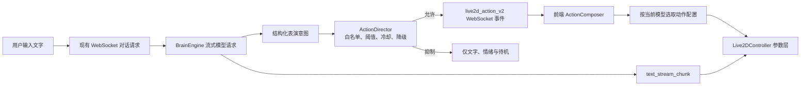

# UNA Live2D 动作导演设计

## 1. 目的与范围

本设计为 UNA 的文字聊天增加由 AI 自动判断触发的 Live2D 动作系统。目标是让 UNA 在日常对话中保持自然、细微的陪伴感，并在明确的高情绪或关键对话节点展现更有辨识度的动漫化表演。

本期只覆盖文字聊天产生的实时动作，不修改账号体系、记忆体系、朋友圈、语音识别或 Live2D 资源文件。动作系统必须复用现有 WebSocket 流式回复、前端参数白名单和口型同步机制。

## 2. 用户体验目标

### 2.1 表现原则

- 以“自然日常、细微陪伴”为默认状态，明显表演只在有充分语义依据时发生。
- 由系统自动判断，无需用户为每条消息选择动作或表现力。
- 每条 AI 回复最多执行一个主表演动作；普通对话允许没有主动作。
- 同一个语义动作在不同回复中有小幅差异，但不会随机到不符合语义的状态。
- 动作不应破坏语音播放时的口型、眨眼和基础情绪。

### 2.2 延迟目标

用户体验按下表衡量；其中“首个 AI 文字分片”是对话性能的关键指标。

| 事件 | 目标 |
| --- | --- |
| 用户消息本地显示 | 0--100 ms |
| 前端“收到消息”微反应 | 100--250 ms |
| 首个 AI 文字分片到达 | 理想不超过 800 ms；可接受不超过 1,500 ms |
| 首句语音开始播放 | 理想 1,500--2,500 ms |
| 2,500 ms 内尚未收到文字 | 展示自然等待状态，不表现为卡死 |

动作判断不得新增第二次模型请求，也不得等待完整回复生成后才发送首个可见文字。动作计划随同现有的一次流式模型请求产生，并以本地规则做轻量校验。

## 3. 现状与改造边界

现有文字聊天已经具备以下链路：

1. `frontend_react/src/hooks/useUnaCore.js` 通过已建立的 WebSocket 发送文字，并立即把用户消息写入界面。
2. `backend/main_server.py` 调用 `brain.chat_stream(...)`，收到 `text_stream_chunk` 后立即广播，TTS 在后台处理。
3. `backend/brain_engine.py` 当前从文本标签中解析 `chat_action`。
4. `useUnaCore` 将 `chat_action` 写入 `actionOverride`。
5. `frontend_react/src/hooks/useLive2DController.js` 以参数白名单和 `safeSetParam` 写入 Live2D 参数，口型在最后覆写。

本期不移除旧 `chat_action`，而是在其旁新增 `live2d_action_v2`。前端优先使用新事件；旧事件只作为兼容回退，直到新版稳定后再决定移除时间。

## 4. 方案选择

| 方案 | 结论 | 原因 |
| --- | --- | --- |
| 扩充文本动作标签 | 不采用为主方案 | 接入快，但输出格式脆弱，动作维度不足，难以稳定随机化。 |
| 结构化表演计划 + 动作编译器 | 采用 | 将 AI 的语义判断与模型参数隔离，支持安全范围、模型差异、随机变体和测试。 |
| AI 直接输出原始 Live2D 参数 | 不采用 | 模型参数不一致且可能越界，容易与口型和 Motion 发生冲突。 |

## 5. 总体架构



系统由以下四个边界清晰的单元构成：

- `BrainEngine`：在同一次模型生成中提供表演意图，不直接生成 Live2D 原始参数。
- `ActionDirector`（后端）：验证意图并做自动触发决策，是动作频率和风险控制的唯一入口。
- `ActionComposer`（前端）：把通过验证的语义动作转换为参数曲线，不处理模型请求或业务语义。
- 模型动作配置：描述某个 Live2D 模型能够承受和支持的参数范围；新增模型只需补配置。

## 6. 后端设计

### 6.1 表演计划协议

模型只可输出下列结构化字段。任何未知字段均被忽略，任何非法值会被后端安全降级为无主动作。

```json
{
  "intent": "shy_happy",
  "intensity": 0.68,
  "expression": "subtle",
  "timing": "after_sentence",
  "duration_ms": 1200,
  "variation_seed": 82914
}
```

字段约束如下：

| 字段 | 规则 |
| --- | --- |
| `intent` | 仅允许第一批意图枚举。 |
| `intensity` | 数值，限制为 0.0--1.0。 |
| `expression` | 仅允许 `subtle` 或 `expressive`。 |
| `timing` | 仅允许 `reply_start`、`after_sentence`、`reply_end`。 |
| `duration_ms` | 限制为 400--2,500 ms。 |
| `variation_seed` | 无符号整数；缺失时由服务端生成。 |

第一批意图固定为 8 个：

1. `warm_listening`：温和倾听。
2. `thinking`：思考或解释前的短暂停顿。
3. `shy_happy`：害羞而开心。
4. `happy_surprise`：开心的惊喜。
5. `gentle_comfort`：温柔安慰。
6. `sad_support`：低落时陪伴。
7. `encouraging`：鼓励用户。
8. `curious_question`：好奇地追问。

### 6.2 ActionDirector 决策

ActionDirector 接收表演计划、当前情绪、上一动作时间和回复上下文，输出“允许的动作事件”或 `None`。它不调用 AI，也不读取或写入 Live2D 参数。

决策规则固定如下：

- 普通说明、连续问答和低情绪文本默认不发送主动作，或只允许低强度 `subtle` 动作。
- `expression=expressive` 只有在高情绪意图、安慰、惊喜、关系推进或明确的关键对话语义下才可能获准；否则降级为 `subtle`。
- 同一会话两个主动作的启动时间至少间隔 3 秒；明显表演动作至少间隔 8 秒。
- 连续三次已发送主动作后，下一次必须抑制，直到出现高情绪或关键对话语义。
- 单条回复只允许一个主动作；若模型给出多个候选，仅保留优先级最高的一个。
- 数据缺失、协议解析失败、上下文不足或异常时，返回 `None`，文字聊天不得失败。

触发结果通过 WebSocket 推送：

```json
{
  "type": "live2d_action_v2",
  "action_id": "uuid",
  "intent": "shy_happy",
  "intensity": 0.68,
  "expression": "subtle",
  "timing": "after_sentence",
  "duration_ms": 1200,
  "variation_seed": 82914
}
```

`action_id` 用于前端去重。新版事件应在首个对应文字分片之前或同一 WebSocket 批次中发送；发送失败不重试为独立对话请求。

## 7. 前端设计

### 7.1 即时微反应

用户文字发送成功后，`useUnaCore` 立即发出本地“收到消息”微反应。该反应不依赖 AI，不经过 WebSocket，且只使用小幅视线转移、轻微点头或呼吸变化；它不是主表演动作。

当收到 `live2d_action_v2` 后，`useUnaCore` 将其传给新的 `ActionComposer`。同一个 `action_id` 只执行一次。旧 `chat_action` 仅在未收到新版事件时作为回退输入。

### 7.2 ActionComposer

ActionComposer 是纯前端模块，职责是将动作事件和当前模型名编译为有限时长的参数轨迹。它必须：

- 只读取语义字段和模型动作配置，不能接受 AI 原始参数。
- 使用 `variation_seed` 在允许的变体中稳定选择，不使用无种子随机数。
- 把 `intensity` 映射为配置范围内的幅度。
- 按“缓入、停留、缓出”生成头部、身体、视线和辅助表情曲线。
- 缺少目标参数或当前模型没有配置时，退化为不执行或最小头部动作。
- 新动作到来时，若当前动作为低优先级则平滑替换；若当前动作为明显表演，则不叠加第二个主动作。

### 7.3 模型动作配置

模型配置按模型名维护，不包含业务判断。例如 `shy_happy` 可以声明头部侧偏、身体小幅摇摆、视线向下和脸颊参数的安全范围。每项参数都必须存在于当前模型的白名单，实际写入前仍由现有 `safeSetParam` 兜底。

配置中记录：

- 该意图支持的参数及其最小、最大值；
- 可选变体；
- 允许的最短、最长时长；
- 是否属于明显表演；
- 对不支持模型的降级策略。

第一批只为当前项目已使用的 Live2D 模型建立配置。后续模型接入不修改后端协议，只添加配置和相应测试。

## 8. 参数优先级与冲突处理

参数写入顺序必须固定，后者只可覆写其明确拥有的参数：

1. 实时口型同步：最高优先级，始终控制嘴部开合和口形。
2. 系统保护与眨眼：保证模型不会停在异常面部状态。
3. 当前 AI 主表演：控制头、身体、视线和允许的辅助表情。
4. AI 基础情绪：提供持续的表情基调。
5. 待机呼吸、微摇摆和无语义的随机微动作。
6. Live2D 默认 Motion。

AI 主表演默认禁止写入嘴部开合参数。若某个模型有特殊嘴部参数，也应在动作结束时明确复位，不能阻塞第 1 层口型同步。

## 9. 错误处理与兼容策略

- 模型输出不能解析：丢弃动作计划，继续文字和语音回复。
- 未知意图、超出范围值或非法时机：ActionDirector 拒绝事件。
- WebSocket 重连、重复事件：以前端 `action_id` 去重；过期事件不再播放。
- 当前模型缺少参数：ActionComposer 跳过缺失参数并选择配置降级动作。
- 动作期间用户发送新消息：中止低优先级主动作并恢复到即时微反应；不影响当前语音队列。
- 旧客户端：忽略不认识的 `live2d_action_v2`，仍可使用既有 `chat_action`。

## 10. 测试与验收

### 10.1 后端单元测试

- 8 个合法意图均能通过协议校验。
- 未知意图、非法枚举、超范围数值均被拒绝或规范化。
- 普通回复在冷却期内不会重复触发主动作。
- 高情绪关键对话可以触发明显表演，普通对话会被降级或抑制。
- 动作解析或规则异常不会中断 `text_stream_chunk`。

### 10.2 前端单元测试

- 相同动作事件和 `variation_seed` 总能编译出相同参数轨迹。
- 参数输出永远不超过模型动作配置范围。
- 不支持参数时不会抛出异常。
- 同一个 `action_id` 不会重复执行。
- 主动作不会改变口型同步拥有的参数。

### 10.3 集成验收

- 发送文字后立刻出现用户消息和轻微“收到”反应。
- 首个文字分片仍按现有流式方式先于完整回复显示。
- 普通连续聊天表现平静自然，不出现每句话都挥手或大幅摇摆。
- 安慰、惊喜、害羞等明确节点有可感知但不突兀的表演。
- 语音播放期间口型连续可用，动作结束后模型平滑回到基础状态。

## 11. 非目标与后续扩展

本期不做用户可调的“表现力”滑杆、不做动作编辑器、不做跨模型自动学习参数范围，也不改变 Live2D 原始 Motion 文件。

后续可在数据验证后扩展：更多意图、用户偏好、动作效果埋点、模型配置可视化工具，以及触摸互动和待机主动行为与本动作系统共用同一优先级队列。
